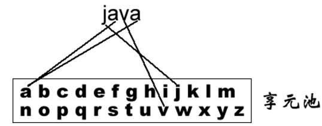
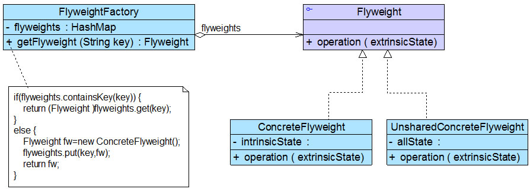
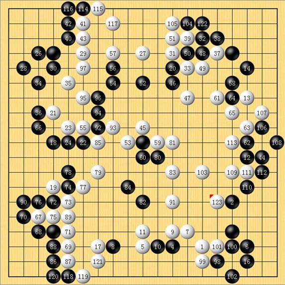
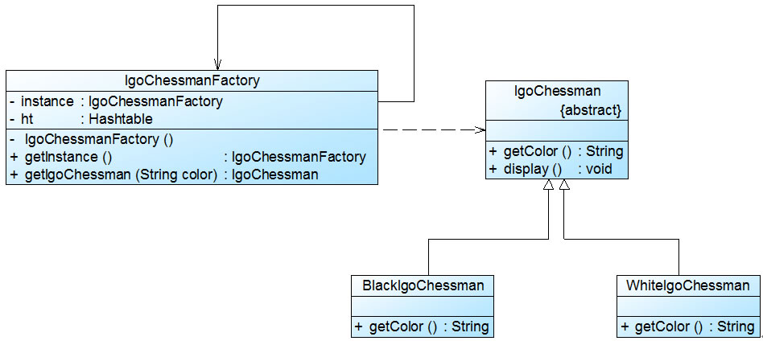
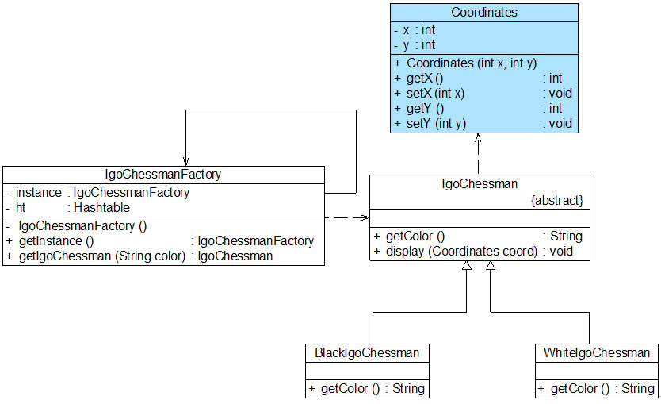

实现对对象的复用——享元模式

# 享元模式的引出
## 生活例子——围棋棋子
当前咱们国家正在大力倡导构建和谐社会，其中一个很重要的组成部分就是建设资源节约型社会，“浪费可耻，节俭光荣”。在软件系统中，有时候也会存在资源浪费的情况，
例如**在计算机内存中存储了多个完全相同或者非常相似的对象，如果这些对象的数量太多将导致系统运行代价过高，内存属于计算机的“稀缺资源”，不应该用来“随便浪费”**，
那么是否存在一种技术可以**用于节约内存使用空间，实现对这些相同或者相似对象的共享访问**呢？答案是肯定，这种技术就是我们本章将要学习的享元模式。


## 享元模式概述
---
## 概述
**当一个软件系统在运行时产生的对象数量太多，将导致运行代价过高，带来系统性能下降等问题**。例如在一个文本字符串中存在很多重复的字符，如果每一个字符都用一个单独的对象来表示，
将会占用较多的内存空间，**那么我们如何去避免**系统中出现大量**相同或相似的**对象，同时又不影响客户端程序通过面向对象的方式对这些对象进行操作？**享元模式正为解决这一类问题而诞生**。
享元模式通过共享技术实现相同或相似对象的重用，**在逻辑上每一个出现的字符都有一个对象与之对应，然而在物理上它们却共享同一个享元对象**，这个对象可以出现在一个字符串的不同地方，
相同的字符对象都指向同一个实例，**在享元模式中，存储这些共享实例对象的地方称为享元池**(Flyweight Pool)。
我们可以针对每一个不同的字符创建一个享元对象，将其放在享元池中，需要时再从享元池取出。



---
## 享元模式的内外部状态
享元模式**以共享的方式高效地支持大量细粒度对象的重用**，享元对象能做到共享的关键**是区分了内部状态(Intrinsic State)和外部状态(Extrinsic State)**。
下面将对享元的内部状态和外部状态进行简单的介绍：

      (1)  内部状态是存储在享元对象内部并且不会随环境改变而改变的状态，内部状态可以共享。如字符的内容，不会随外部环境的变化而变化，无论在任何环境下字符“a”始终是“a”，都不会变成“b”。

      (2)  外部状态是随环境改变而改变的、不可以共享的状态。**享元对象的外部状态通常由客户端保存，并在享元对象被创建之后，需要使用的时候再传入到享元对象内部**。
           一个外部状态与另一个外部状态之间是相互独立的。如字符的颜色，可以在不同的地方有不同的颜色，例如**有的“a”是红色的，有的“a”是绿色的**，字符的大小也是如此，
           **有的“a”是五号字，有的“a”是四号字**。而且字符的颜色和大小是两个独立的外部状态，它们可以独立变化，相互之间没有影响，客户端可以在使用时将外部状态注入享元对象中。
           正因为区分了内部状态和外部状态，我们可以将具有相同内部状态的对象存储在享元池中，**享元池中的对象是可以实现共享的，需要的时候就将对象从享元池中取出，实现对象的复用**。
           **通过向取出的对象注入不同的外部状态，可以得到一系列相似的对象，而这些对象在内存中实际上只存储一份**。


---
## 享元模式定义

享元模式(Flyweight Pattern)：运用共享技术有效地支持大量细粒度对象的复用。系统只使用少量的对象，而这些对象都很相似，状态变化很小，可以实现对象的多次复用。
由于享元模式要求能够共享的对象必须是细粒度对象，因此它又称为轻量级模式，它是一种对象结构型模式。

## 享元模式的组成角色
享元模式结构较为复杂，一般结合工厂模式一起使用，在它的结构图中包含了一个享元工厂类，其结构图如图所示：

在享元模式结构图中包含如下几个角色：

● Flyweight（抽象享元类）：通常是一个接口或抽象类，在抽象享元类中声明了具体享元类公共的方法，这些方法可以向外界提供享元对象的内部数据（内部状态），同时也可以通过这些方法来设置外部数据（外部状态）。

● ConcreteFlyweight（具体享元类）：它实现了抽象享元类，其实例称为享元对象；在具体享元类中为内部状态提供了存储空间。通常我们可以结合单例模式来设计具体享元类，为每一个具体享元类提供唯一的享元对象。

● UnsharedConcreteFlyweight（非共享具体享元类）：并不是所有的抽象享元类的子类都需要被共享，不能被共享的子类可设计为非共享具体享元类；当需要一个非共享具体享元类的对象时可以直接通过实例化创建。

● FlyweightFactory（享元工厂类）：享元工厂类用于创建并管理享元对象，它针对抽象享元类编程，将各种类型的具体享元对象存储在一个享元池中，享元池一般设计为一个存储“键值对”的集合（也可以是其他类型的集合），
  可以结合工厂模式进行设计；当用户请求一个具体享元对象时，享元工厂提供一个存储在享元池中已创建的实例或者创建一个新的实例（如果不存在的话），返回新创建的实例并将其存储在享元池中。

---
## 享元模式的典型代码

### 享元工厂类
**在享元模式中引入了享元工厂类，享元工厂类的作用在于提供一个用于存储享元对象的享元池**，当用户需要对象时，首先从享元池中获取，如果享元池中不存在，则创建一个新的享元对象返回给用户，并在享元池中保存该新增对象。
典型的享元工厂类的代码如下：

```java
class FlyweightFactory {
  //定义一个HashMap用于存储享元对象，实现享元池
  private HashMap flyweights = newHashMap();

  public Flyweight getFlyweight(String key) {
    //如果对象存在，则直接从享元池获取
    if (flyweights.containsKey(key)) {
      return (Flyweight) flyweights.get(key);
    }
    //如果对象不存在，先创建一个新的对象添加到享元池中，然后返回
    else {
      Flyweight fw = newConcreteFlyweight();
      flyweights.put(key, fw);
      return fw;
    }
  }
}

```

---
### 享元类
享元类的设计是享元模式的要点之一，在享元类中要将内部状态和外部状态分开处理，通常将内部状态作为享元类的成员变量，而外部状态通过注入的方式添加到享元类中。
典型的享元类代码如下所示：
```java
class Flyweight {
  //内部状态intrinsicState作为成员变量，同一个享元对象其内部状态是一致的
  private String intrinsicState;
  
  public Flyweight(String intrinsicState) {
    this.intrinsicState = intrinsicState;
  }
  
  //外部状态extrinsicState在使用时由外部设置，不保存在享元对象中，即使是同一个对象，在每一次调用时也可以传入不同的外部状态
  public void operation(String extrinsicState) {
              //......
  }
}
```

---
# 真实项目
## 围棋棋子的设计


围棋棋盘中包含大量的黑子和白子，它们的形状、大小都一模一样，只是出现的位置不同而已。
如果将每一个棋子都作为一个独立的对象存储在内存中，将导致该围棋软件在运行时所需内存空间较大，如何降低运行代价、提高系统性能?
Sunny公司开发人员决定使用享元模式来设计该围棋软件的棋子对象
结构图：


**IgoChessman充当抽象享元类，BlackIgoChessman和WhiteIgoChessman充当具体享元类，IgoChessmanFactory充当享元工厂类。**
完整代码如下所示：
见源码即可
---
# 带外部状态的解决方案
发现虽然黑色棋子和白色棋子可以共享，但是它们将显示在棋盘的不同位置，如何让相同的黑子或者白子能够多次重复显示且位于一个棋盘的不同地方？
解决方法就是将棋子的**位置定义为棋子的一个外部状态**，在需要时再进行设置。因此，我们在图14-4中增加了一个新的类Coordinates（坐标类），
用于存储每一个棋子的位置，修改之后的结构图如图14-5所示：


除了增加一个坐标类Coordinates以外，抽象享元类IgoChessman中的display()方法也将对应增加一个Coordinates类型的参数，用于在显示棋子时指定其坐标，
Coordinates类和修改之后的IgoChessman类的代码如下所示：


# 享元模式总结
当系统中存在大量相同或者相似的对象时，享元模式是一种较好的解决方案，它通过共享技术实现相同或相似的细粒度对象的复用，从而节约了内存空间，提高了系统性能。
相比其他结构型设计模式，享元模式的使用频率并不算太高，但是作为一种以“节约内存，提高性能”为出发点的设计模式，它在软件开发中还是得到了一定程度的应用。

---
## 1.主要优点

       享元模式的主要优点如下：

       (1) 可以极大减少内存中对象的数量，使得相同或相似对象在内存中只保存一份，从而可以节约系统资源，提高系统性能。

       (2) 享元模式的外部状态相对独立，而且不会影响其内部状态，从而使得享元对象可以在不同的环境中被共享。

---
## 2.主要缺点

       享元模式的主要缺点如下：

       (1) 享元模式使得系统变得复杂，需要分离出内部状态和外部状态，这使得程序的逻辑复杂化。

       (2) 为了使对象可以共享，享元模式需要将享元对象的部分状态外部化，而读取外部状态将使得运行时间变长。

---
## 3.适用场景

       在以下情况下可以考虑使用享元模式：

       (1) 一个系统有大量相同或者相似的对象，造成内存的大量耗费。//比如文档中的相同图片,图片本身信息与位置

       (2) 对象的大部分状态都可以外部化，可以将这些外部状态传入对象中。

       (3) 在使用享元模式时需要维护一个存储享元对象的享元池，而这需要耗费一定的系统资源，因此，应当在需要多次重复使用享元对象时才值得使用享元模式。

