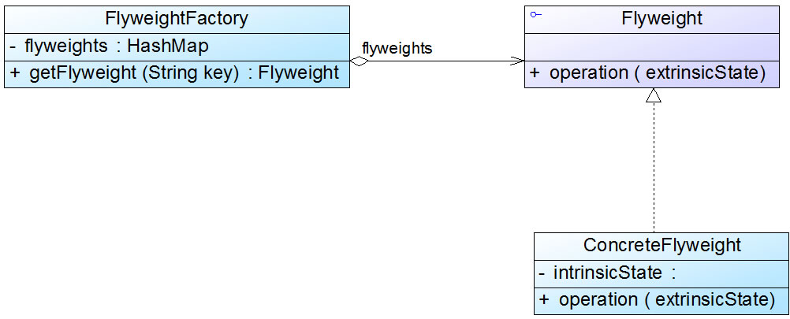
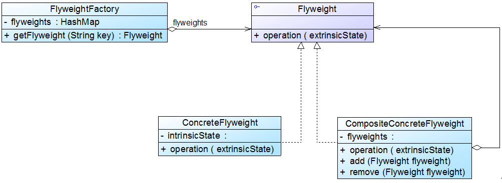

# 单纯享元模式和复合享元模式
标准的享元模式结构图中既包含可以共享的具体享元类，也包含不可以共享的非共享具体享元类。但是在实际使用过程中，我们有时候会用到两种特殊的享元模式：
单纯享元模式和复合享元模式，下面将对这两种特殊的享元模式进行简单的介绍：

---
## 1.单纯享元模式
在单纯享元模式中，所有的具体享元类都是可以共享的，不存在非共享具体享元类。


---
## 2.复合享元模式
将一些单纯享元对象**使用组合模式加以组合，还可以形成复合享元对象**，这样的复合享元对象本身不能共享，但是它们可以分解成单纯享元对象，而后者则可以共享。


通过复合享元模式，可以确保复合享元类CompositeConcreteFlyweight中所包含的每个单纯享元类ConcreteFlyweight**都具有相同的外部状态**，
而这些单纯享元的内部状态往往可以不同。**如果希望为多个内部状态不同的享元对象设置相同的外部状态，可以考虑使用复合享元模式**。

# 关于享元模式的几点补充
1.与其他模式的联用

       享元模式通常需要和其他模式一起联用，几种常见的联用方式如下：

       (1)在享元模式的享元工厂类中通常提供一个静态的工厂方法用于返回享元对象，使用简单工厂模式来生成享元对象。

       (2)在一个系统中，通常只有唯一一个享元工厂，因此可以使用单例模式进行享元工厂类的设计。

       (3)享元模式可以结合组合模式形成复合享元模式，统一对多个享元对象设置外部状态。

2.享元模式与String类

       JDK类库中的String类使用了享元模式，我们通过如下代码来加以说明：
```java
class Demo {
    public static void main(String args[]) {

        String str1 = "abcd";

        String str2 = "abcd";

        String str3 = "ab" + "cd";

        String str4 = "ab";

        str4 += "cd";
        
        System.out.println(str1 == str2);

        System.out.println(str1 == str3);

        System.out.println(str1 == str4);
        
        str2 += "e";

        System.out.println(str1 == str2);
    }
}
```
在Java语言中，如果每次执行类似String str1="abcd"的操作**时都创建一个新的字符串对象将导致内存开销很大**，因此如果第一次创建了内容为"abcd"的字符串对象str1，
下一次再创建内容相同的字符串对象str2时会将它的引用指向"abcd"，不会重新分配内存空间，从而实现了"abcd"在内存中的共享。上述代码输出结果如下：

运行结果
true
true
false
false
---
可以看出，前两个输出语句均为true，说明str1、str2、str3在内存中引用了相同的对象；如果有一个字符串str4，其初值为"ab"，再对它进行操作str4 += "cd"，
**此时虽然str4的内容与str1相同，但是由于str4的初始值不同，在创建str4时重新分配了内存**，所以第三个输出语句结果为false；最后一个输出语句结果也为false，
说明当对str2进行修改时将创建一个新的对象，修改工作在新对象上完成，而原来引用的对象并没有发生任何改变，str1仍然引用原有对象，而str2引用新对象，str1与str2引用了两个完全不同的对象。

## 拓展——String类的Copy On Write
关于Java String类这种在修改享元对象时，先将原有对象复制一份，然后在新对象上再实施修改操作的机制称为“Copy On Write”，大家可以自行查询相关资料来进一步了解和学习“Copy On Write”机制，在此不作详细说明。


