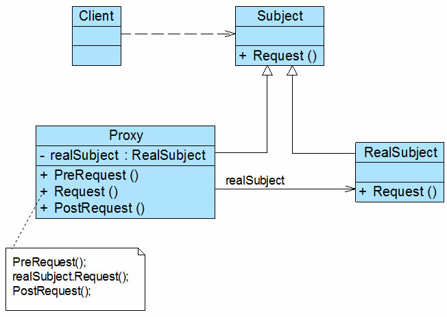

# 基础
代理模式是常用的结构型设计模式之一，当无法直接访问某个对象或访问某个对象存在困难时可以通过一个代理对象来间接访问，为了保证客户端使用的透明性，**所访问的真实对象与代理对象需要实现相同的接口**。
根据代理模式的使用目的不同，代理模式又可以分为多种类型，例如**保护代理、远程代理、虚拟代理、缓冲代理**等，它们应用于不同的场合，满足用户的不同需求。

---
# 代理模式概述
## 生活例子——商品代购
近年来，代购已逐步成为电子商务的一个重要分支。何谓代购，简单来说就是找人帮忙购买所需要的商品，当然你可能需要向实施代购的人支付一定的费用。
代购通常分为两种类型：
一种是因为在当地买不到某件商品，又或者是**因为当地这件商品的价格比其他地区的贵**，因此托人在其他地区甚至国外购买该商品，然后通过快递发货或者直接携带回来；
还有一种代购，由于消费者对想要购买的商品相关信息的缺乏，**自已无法确定其实际价值而又不想被商家宰**，只好委托中介机构帮其讲价或为其代买。代购网站为此应运而生，
它为消费者提供在线的代购服务，如果看中某国外购物网站上的商品，可以登录代购网站填写代购单并付款，代购网站会帮助进行购买然后通过快递公司将商品发送给消费者。

---
## 定义
代理模式：**给某一个对象提供一个代理或占位符，并由代理对象来控制对原对象的访问**。

代理模式是一种对象结构型模式。在代理模式中引入了一个新的代理对象，**代理对象在客户端对象和目标对象之间起到中介的作用，它去掉客户不能看到的内容和服务或者增添客户需要的额外的新服务**。

---
# 代理模式结构与实现
## 结构图
代理模式的结构比较简单，其核心是代理类，为了让客户端能够一致性地对待真实对象和代理对象，在代理模式中引入了抽象层，代理模式结构如图15-2所示：



## 角色组成

       (1) Subject（抽象主题角色）：它声明了**真实主题和代理主题的共同接口**，这样一来**在任何使用真实主题的地方都可以使用代理主题，客户端通常需要针对抽象主题角色进行编程**。

       (2) Proxy（代理主题角色）：它包含了对真实主题的引用，从而可以在任何时候操作真实主题对象；在代理主题角色中提供一个与真实主题角色相同的接口，
         以便在任何时候都可以替代真实主题；代理主题角色还可以控制对真实主题的使用，负责在需要的时候创建和删除真实主题对象，并对真实主题对象的使用加以约束。
         通常，在代理主题角色中，客户端在调用所引用的真实主题操作之前或之后还需要执行其他操作，而不仅仅是单纯调用真实主题对象中的操作。

       (3) RealSubject（真实主题角色）：它定义了代理角色所代表的真实对象，在真实主题角色中实现了真实的业务操作，客户端可以通过代理主题角色间接调用真实主题角色中定义的操作。

## 典型代码
### 抽象主题类
```java
// 定义 Subject 接口
public interface Subject {
    void request();  // 定义接口中的方法
}
```

### 真实主题类
```java
// 实现 RealSubject 类
public class RealSubject implements Subject {

    @Override
    public void request() {
        // 业务方法具体实现代码
        System.out.println("Executing request in RealSubject");
    }
}
```

### 代理类
代理类也是抽象主题类的子类，它维持一个对真实主题对象的引用，调用在真实主题中实现的业务方法，在调用时可以在原有业务方法的基础上附加一些新的方法来对功能进行扩充或约束

```java
// 实现 Proxy 类
public class Proxy implements Subject {
    
    private RealSubject realSubject;  // 维持对真实主题对象的引用

    public Proxy() {
        // 初始化真实主题对象
        this.realSubject = new RealSubject();
    }
    
    // 前置处理
    public void preRequest() {
        // 代理对象执行前的操作
        System.out.println("Executing preRequest in Proxy");
    }

    // 代理的业务方法
    @Override
    public void request() {
        preRequest();  // 调用前置方法
        realSubject.request();  // 调用真实主题对象的方法
        postRequest();  // 调用后置方法
    }

    // 后置处理
    public void postRequest() {
        // 代理对象执行后的操作
        System.out.println("Executing postRequest in Proxy");
    }
}
```

# 代理类分类
       在实际开发过程中，代理类的实现比上述代码要复杂很多，代理模式根据其目的和实现方式不同可分为很多种类，其中常用的几种代理模式简要说明如下：

(1) 远程代理(Remote Proxy)：为一个位于不同的地址空间的对象提供一个本地的代理对象，这个不同的地址空间可以是在同一台主机中，也可是在另一台主机中，**远程代理又称为大使**(Ambassador)。

(2) 虚拟代理(Virtual Proxy)：**如果需要创建一个资源消耗较大的对象，先创建一个消耗相对较小的对象来表示，真实对象只在需要时才会被真正创建**。

(3) 保护代理(Protect Proxy)：控制对一个对象的访问，**可以给不同的用户提供不同级别的使用权限**。

(4) 缓冲代理(Cache Proxy)：为某一个目标操作的结果**提供临时的存储空间，以便多个客户端可以共享这些结果**。

(5) 智能引用代理(Smart Reference Proxy)：当一个对象被引用时，提供一些额外的操作，例如将对象被调用的次数记录下来等。

       在这些常用的代理模式中，有些代理类的设计非常复杂，例如远程代理类，**它封装了底层网络通信和对远程对象的调用**，其实现较为复杂。

---
# 代理模式适用场景
代理模式的类型较多，不同类型的代理模式有不同的优缺点，它们应用于不同的场合：

       (1) 当客户端对象需要访问远程主机中的对象时可以使用远程代理。

       (2) 当需要用一个消耗资源较少的对象来代表一个消耗资源较多的对象，从而降低系统开销、缩短运行时间时可以使用虚拟代理，例如一个对象需要很长时间才能完成加载时。

       (3) 当需要为某一个被频繁访问的操作结果提供一个临时存储空间，以供多个客户端共享访问这些结果时可以使用缓冲代理。通过使用缓冲代理，系统无须在客户端每一次访问时都重新执行操作，只需直接从临时缓冲区获取操作结果即可。

       (4) 当需要控制对一个对象的访问，为不同用户提供不同级别的访问权限时可以使用保护代理。

       (5) 当需要为一个对象的访问（引用）提供一些额外的操作时可以使用智能引用代理。


---
# 模式优点

代理模式的共同优点如下：

       (1) 能够协调调用者和被调用者，在一定程度上降低了系统的耦合度。

       (2) 客户端可以针对抽象主题角色进行编程，增加和更换代理类无须修改源代码，符合开闭原则，系统具有较好的灵活性和可扩展性。

此外，不同类型的代理模式也具有独特的优点，例如：

       (1) 远程代理为位于两个不同地址空间对象的访问提供了一种实现机制，**可以将一些消耗资源较多的对象和操作移至性能更好的计算机上，提高系统的整体运行效率**。

       (2) 虚拟代理通过一个消耗资源较少的对象来代表一个消耗资源较多的对象，可以在一定程度上节省系统的运行开销。

       (3) 缓冲代理为某一个操作的结果提供临时的缓存存储空间，以便在后续使用中能够共享这些结果，优化系统性能，缩短执行时间。

       (4) 保护代理可以控制对一个对象的访问权限，为不同用户提供不同级别的使用权限。

---
# 模式缺点
代理模式的主要缺点如下：

       (1) 由于在客户端和真实主题之间增加了代理对象，因此有些类型的代理模式可能会造成请求的处理速度变慢，例如保护代理。

       (2) 实现代理模式需要额外的工作，而且有些代理模式的实现过程较为复杂，例如远程代理。
