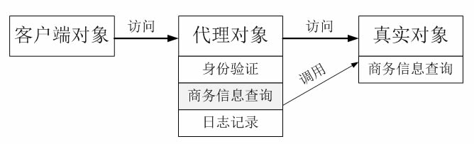
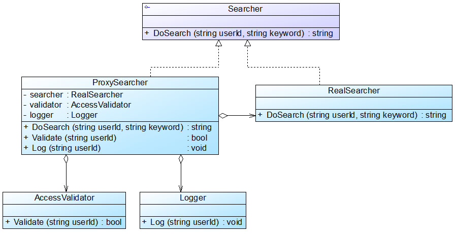

# 实例说明
某软件公司承接了某信息咨询公司的收费商务信息查询系统的开发任务，该系统的基本需求如下：

       (1) 在进行商务信息查询之前用户需要通过身份验证，只有合法用户才能够使用该查询系统；

       (2) 在进行商务信息查询时系统需要记录查询日志，以便根据查询次数收取查询费用。

该软件公司开发人员已完成了商务信息查询模块的开发任务，**现希望能够以一种松耦合的方式向原有系统增加身份验证和日志记录功能**，
客户端代码可以无区别地对待原始的商务信息查询模块和增加新功能之后的商务信息查询模块，**而且可能在将来还要在该信息查询模块中增加一些新的功能**。
试使用代理模式设计并实现该收费商务信息查询系统。

# 实例分析及类图

可以采用**一种间接访问的方式来实现该商务信息查询系统的设计**，在客户端对象和信息查询对象之间增加一个代理对象，**让代理对象来实现身份验证和日志记录等功能**，
**而无须直接对原有的商务信息查询对象进行修改**:

在上图中，业务类AccessValidator用于验证用户身份，业务类Logger用于记录用户查询日志，Searcher充当抽象主题角色，RealSearcher充当真实主题角色，ProxySearcher充当代理主题角色。

## 项目实例分析
本实例是保护代理和智能引用代理的应用实例，在代理类ProxySearcher中实现对真实主题类的权限控制和引用计数，如果需要在访问真实主题时增加新的访问控制机制和新功能，
只需增加一个新的代理类，再修改配置文件，在客户端代码中使用新增代理类即可，源代码无须修改，符合开闭原则。

