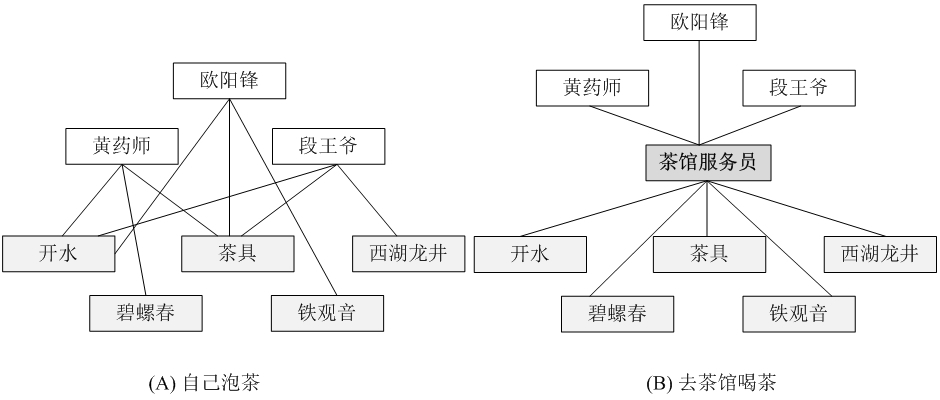
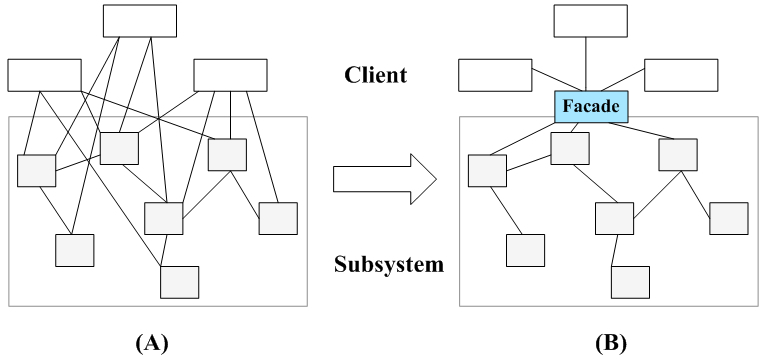
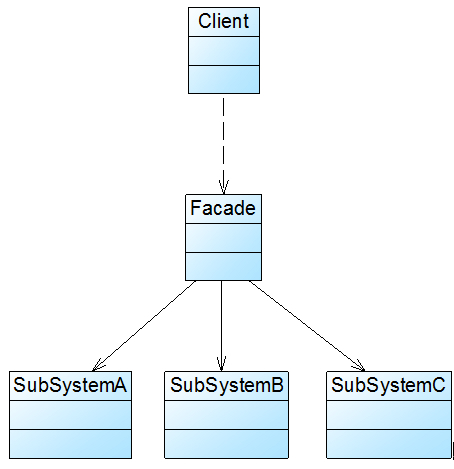
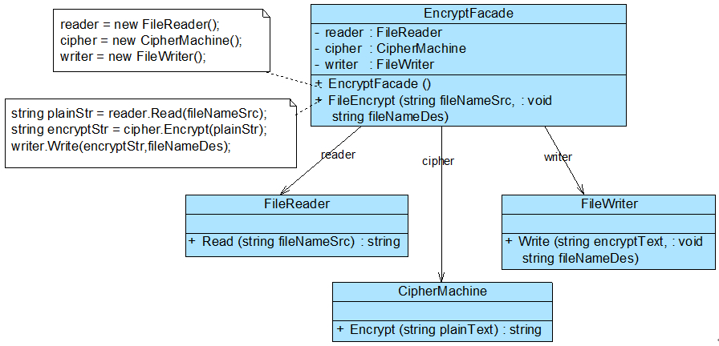
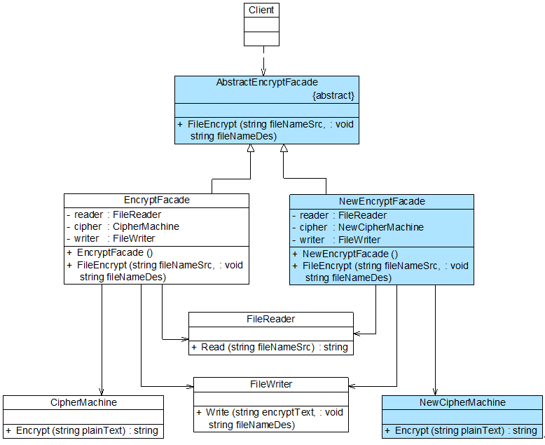

几乎所有的软件都有外观模式的身影。

# 定义：
外观模式：`为子系统中的一组接口提供一个统一的入口。外观模式定义了一个高层接口，这个接口使得这一子系统更加容易使用。`
说明： `外观模式是一种**使用频率非常高**的结构型设计模式，**它通过引入一个外观角色来简化客户端与子系统之间的交互**，`为复杂的子系统调用提供一个统一的入口，`**降低子系统与客户端的耦合度，且客户端调用非常方便**。`

# 外观模式概述:
## 生活中的例子：
可以使用自己泡茶喝和去茶馆点茶喝的案例来说明：
不知道大家有没有比较过自己泡茶和去茶馆喝茶的区别，如果是自己泡茶需要自行准备茶叶、茶具和开水，如图1(A)所示，而去茶馆喝茶，最简单的方式就是跟茶馆服务员说想要一杯什么样的茶，
是铁观音、碧螺春还是西湖龙井？正因为茶馆有服务员，顾客无须直接和茶叶、茶具、开水等交互，整个泡茶过程由服务员来完成，顾客只需与服务员交互即可，整个过程非常简单省事，如图所示:

图中的服务员就是充当的外观类，上面的顾客就是客户端，下面的各种工具就是子系统，这使得客户端调用子系统非常方面。

## 外观类的引出背景：
在软件开发中，有时候为了完成一项较为复杂的功能，一个客户类需要和多个业务类交互，而这些需要交互的业务类经常会作为一个整体出现，由于涉及到的类比较多，
导致使用时代码较为复杂，此时，特别需要一个类似服务员一样的角色，由它来负责和多个业务类进行交互，而客户类只需与该类交互。外观模式通过引入一个新的
外观类(Facade)来实现该功能，外观类充当了软件系统中的“服务员”，它为多个业务类的调用提供了一个统一的入口，简化了类与类之间的交互。在外观模式中，
那些需要交互的业务类被称为子系统(Subsystem)。如果没有外观类，那么每个客户类需要和多个子系统之间进行复杂的交互，系统的耦合度将很大，如图2(A)所示；
而引入外观类之后，客户类只需要直接与外观类交互，客户类与子系统之间原有的复杂引用关系由外观类来实现，从而降低了系统的耦合度，如图2(B)所示。



外观模式中，**一个子系统的外部与其内部的通信通过一个统一的外观类进行**，外观类将客户类与子系统的内部复杂性分隔开，**使得客户类只需要与外观角色打交道，而不需要与子系统内部的很多对象打交道**。
**(说白了就是加一层的思想)**
外观模式又称为门面模式，它是一种对象结构型模式。外观模式是迪米特法则的一种具体实现，通过引入一个新的外观角色可以降低原有系统的复杂度，同时降低客户类与子系统的耦合度。


# 外观模式的结构与实现
## 模式结构


## 角色组成
      (1) Facade（外观角色）：在客户端可以调用它的方法，在外观角色中可以知道相关的（一个或者多个）子系统的功能和责任；在正常情况下，
          它将所有从客户端发来的请求委派到相应的子系统去，传递给相应的子系统对象处理。

      (2) SubSystem（子系统角色）：在软件系统中可以有一个或者多个子系统角色，每一个子系统可以不是一个单独的类，而是一个类的集合，它实现子系统的功能；
          每一个子系统都可以被客户端直接调用，或者被外观角色调用，它处理由外观类传过来的请求；子系统并不知道外观的存在，对于子系统而言，外观角色仅仅是另外一个客户端而已。

## 代码实现

外观模式中所指的子系统是一个广义的概念，它可以是一个类、一个功能模块、系统的一个组成部分或者一个完整的系统。子系统类通常是一些业务类，实现了一些具体的、独立的业务功能，其典型代码如下：

---
### 子系统

```java
class SubSystemA {
    public void MethodA() {
        //业务实现代码
    }
}

class SubSystemB {
    public void MethodB() {
        //业务实现代码
    }
}

class SubSystemC {
    public void MethodC() {
        //业务实现代码
    }
}
```
---
### 外观类

```java
class Facade {
    private SubSystemA obj1 = new SubSystemA();
    private SubSystemB obj2 = new SubSystemB();
    private SubSystemC obj3 = new SubSystemC();

    public void Method() { //这里就会扣定义中的为子系统的一组接口提供统一的接口！！
        obj1.MethodA();
        obj2.MethodB();
        obj3.MethodC();
    }
}
```
---
### 客户端
```java
class Program {
    static void Main(string[] args) {
        Facade facade = new Facade(); 
        facade.Method();//客户端调用子系统的所有方法就方便多了，只需要这一个接口(一层层套娃的思想发挥到了极致)！！
    }
}
```
---
# 项目实战

## 项目背景
某软件公司欲开发一个可应用于多个软件的文件加密模块，该模块可以对文件中的数据进行加密并将加密之后的数据存储在一个新文件中，具体的流程包括三个部分，
分别是**读取源文件、加密、保存加密之后的文件**，其中，**读取文件和保存文件使用流来实现**，**加密操作通过求模运算实现**。这三个操作相对独立，为了实现代码的独立重用，
让设计更符合单一职责原则，这三个操作的业务代码封装在三个不同的类中。 现使用外观模式设计该文件加密模块。

## 项目结构


---
# 抽象外观类
## 引出
在标准的外观模式结构图中，如果需要增加、删除或更换与外观类交互的子系统类，必须修改外观类或客户端的源代码，这将违背开闭原则，因此可以通过引入抽象外观类
来对系统进行改进，在一定程度上可以解决该问题。在引入抽象外观类之后，客户端可以针对抽象外观类进行编程，对于新的业务需求，不需要修改原有外观类，而对应增加
一个新的具体外观类，由新的具体外观类来关联新的子系统对象，同时通过修改配置文件来达到不修改任何源代码并更换外观类的目的。

---
### 新需求
如果增加一个加密类。将目标文字转化为后移一位，而不是对2求模，怎样操作？

### 新实现
客户端面向抽象外观类接口编程 + 新增实现类 + 通过修改配置文件完成




# 外观模式效果与适用场景
外观模式是一种使用频率非常高的设计模式，它通过引入一个外观角色来简化客户端与子系统之间的交互，**为复杂的子系统调用提供一个统一的入口，使子系统与客户端的耦合度降低**，
且客户端调用非常方便。**外观模式并不给系统增加任何新功能，它仅仅是简化调用接口**。**在几乎所有的软件中都能够找到外观模式的应用，如绝大多数B/S系统都有一个首页或者导航页面，
大部分C/S系统都提供了菜单或者工具栏，在这里，首页和导航页面就是B/S系统的外观角色，而菜单和工具栏就是C/S系统的外观角色，通过它们用户可以快速访问子系统，降低了系统的复杂程度。
所有涉及到与多个业务对象交互的场景都可以考虑使用外观模式进行重构**。

---
## 模式优点

       (1) 它对客户端屏蔽了子系统组件，减少了客户端所需处理的对象数目，并使得子系统使用起来更加容易。通过引入外观模式，客户端代码将变得很简单，与之关联的对象也很少。

       (2) 它实现了子系统与客户端之间的松耦合关系，这使得子系统的变化不会影响到调用它的客户端，只需要调整外观类即可。

       (3) 一个子系统的修改对其他子系统没有任何影响，而且子系统内部变化也不会影响到外观对象。

## 模式缺点

       (1) 不能很好地限制客户端直接使用子系统类，如果对客户端访问子系统类做太多的限制则减少了可变性和灵活 性。

       (2) 如果设计不当，增加新的子系统可能需要修改外观类的源代码，违背了开闭原则。

---
## 模式适用场景

       (1) 当要为访问一系列复杂的子系统提供一个简单入口时可以使用外观模式。

       (2) 客户端程序与多个子系统之间存在很大的依赖性。引入外观类可以将子系统与客户端解耦，从而提高子系统的独立性和可移植性。

       (3) 在层次化结构中，可以使用外观模式定义系统中每一层的入口，层与层之间不直接产生联系，而通过外观类建立联系，降低层之间的耦合度。


