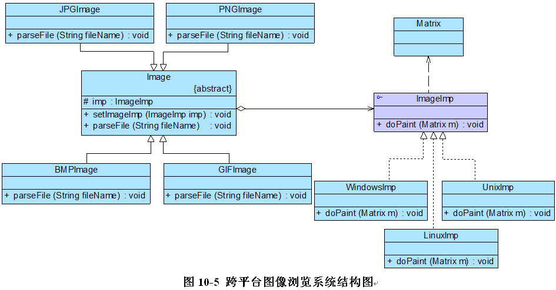

# 完整解决方案

为了减少所需生成的子类数目，实现将操作系统和图像文件格式两个维度分离，使它们可以独立改变，Sunny公司开发人员使用桥接模式来重构跨平台图像浏览系统的设计

Image充当抽象类，其子类JPGImage、PNGImage、BMPImage和GIFImage**充当扩充抽象类**；ImageImp充当实现类接口，其子类WindowsImp、LinuxImp和UnixImp**充当具体实现类**。完整代码如下所示：

