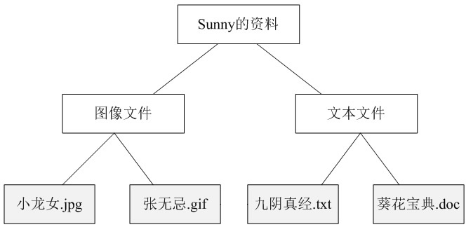
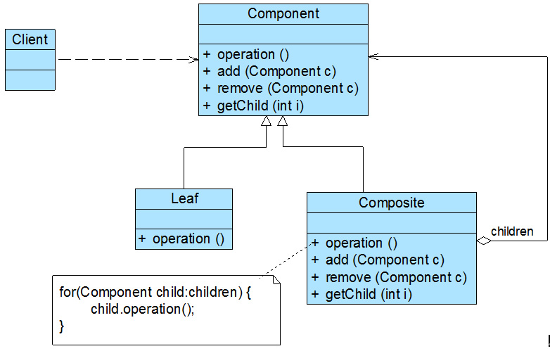
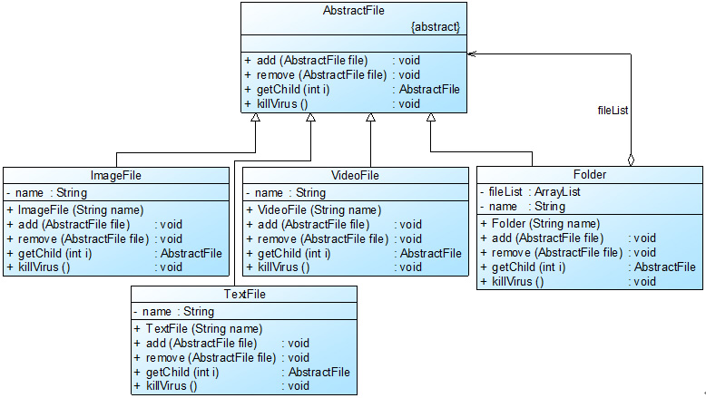

# 引出背景——对树形结构的统一处理

树形结构在软件中随处可见，例如操作系统中的目录结构、应用软件中的菜单、办公系统中的公司组织结构等等，如何运用面向对象的方式来处理这种树形结构是组合模式需要解决的问题，
组合模式通过一种巧妙的设计方案使得用户可以一致性地处理整个树形结构或者树形结构的一部分，也可以一致性地处理树形结构中的叶子节点（不包含子节点的节点）和容器节点（包含子节点的节点）。
下面将学习这种用于**处理树形结构的组合模式**。

# 项目

## 项目介绍
Sunny软件公司欲开发一个杀毒(AntiVirus)软件，该软件既可以对某个文件夹(Folder)杀毒，也可以对某个指定的文件(File)进行杀毒。该杀毒软件还可以根据各类文件的特点，
为不同类型的文件提供不同的杀毒方式，例如图像文件(ImageFile)和文本文件(TextFile)的杀毒方式就有所差异。现需要提供该杀毒软件的整体框架设计方案。

我们可以看出，在上图中包含文件（灰色节点）和文件夹（白色节点）两类不同的元素，其中在文件夹中可以包含文件，还可以继续包含子文件夹，但是在文件中不能再包含子文件或者子文件夹。
在此，**我们可以称文件夹为容器(Container)**，而不同类型的各种文件是其成员，**也称为叶子(Leaf)**，一个文件夹也可以作为另一个更大的文件夹的成员。
如果我们现在要对某一个文件夹进行操作，如查找文件，那么需要对指定的文件夹进行遍历，如果存在子文件夹则打开其子文件夹继续遍历，如果是文件则判断之后返回查找结果。

## 版本一
一种直觉就是直接对文件夹、文本文件、视频文件、图像文件都建立各自的类，其中文件里面将后三者的集合作为成员变量，并实现增删杀毒功能。而后三者只是单纯的
杀毒，没有增删操作。这样的架构方案是可行的，但是存在如下缺点：

    1.会有大量的代码冗余
    2.没有抽象层，各种扩展也不方便。
    3.容器类和叶子结点的处理方式不一样。客户端需要区分它们，不方便统一管理，而我们的目的就是越统一越好。


## 版本二
## 组合模式
### 定义

组合模式(Composite Pattern)：
组合多个对象形成树形结构以表示具有“整体—部分”关系的层次结构。组合模式对单个对象（即叶子对象）和组合对象（即容器对象）
的使用**具有一致性**，组合模式又可以称为“**整体—部分”(Part-Whole)模式**，它是一种对象结构型模式。


### 组成角色
在组合模式结构图中包含如下几个角色：

      ● Component（抽象构件）：它可以是接口或抽象类，为叶子构件和容器构件对象声明接口，在该角色中可以包含所有子类共有行为的声明和实现。在抽象构件中定义了访问及管理它的子构件的方法，如增加子构件、删除子构件、获取子构件等。

      ● Leaf（叶子构件）：它在组合结构中表示叶子节点对象，叶子节点没有子节点，它实现了在抽象构件中定义的行为。对于那些访问及管理子构件的方法，可以通过异常等方式进行处理。

      ● Composite（容器构件）：它在组合结构中表示容器节点对象，容器节点包含子节点，其子节点可以是叶子节点，也可以是容器节点，它提供一个集合
        用于存储子节点，实现了在抽象构件中定义的行为，包括那些访问及管理子构件的方法，在其业务方法中可以递归调用其子节点的业务方法。


      组合模式的关键是定义了一个抽象构件类，它既可以代表叶子，又可以代表容器，而客户端针对该抽象构件类进行编程，无须知道它到底表示的是叶子还是容器，
      可以对其进行统一处理。同时容器对象与抽象构件类之间还建立一个聚合关联关系，在容器对象中既可以包含叶子，也可以包含容器，以此实现递归组合，形成一个树形结构。


### 典型代码：
#### 抽象构件
```java
abstract class Component {
	public abstract void add(Component c); //增加成员
	public abstract void remove(Component c); //删除成员
	public abstract Component getChild(int i); //获取成员
	public abstract void operation();  //业务方法
}
```
一般将抽象构件类设计为接口或抽象类，将所有子类共有方法的声明和实现放在抽象构件类中。对于客户端而言，将针对抽象构件编程，而无须关心其具体子类是容器构件还是叶子构件。


#### 叶子构件
```java
class Leaf extends Component {
	public void add(Component c) { 
		//异常处理或错误提示 
	}	
		
	public void remove(Component c) { 
		//异常处理或错误提示 
	}
	
	public Component getChild(int i) { 
		//异常处理或错误提示
		return null; 
	}
	
	public void operation() {
		//叶子构件具体业务方法的实现
	} 
}
```

作为抽象构件类的子类，在叶子构件中需要实现在抽象构件类中声明的所有方法，包括业务方法以及管理和访问子构件的方法，但是叶子构件不能再包含子构件，
因此在叶子构件中实现子构件管理和访问方法时需要提供异常处理或错误提示。当然，这无疑会给叶子构件的实现带来麻烦。


#### 容器构件
```java
class Composite extends Component {
	private ArrayList<Component> list = new ArrayList<Component>();
	
	public void add(Component c) {
		list.add(c);
	}
	
	public void remove(Component c) {
		list.remove(c);
	}
	
	public Component getChild(int i) {
		return (Component)list.get(i);
	}
	
	public void operation() {
		//容器构件具体业务方法的实现
        //递归调用成员构件的业务方法
		for(Object obj:list) {
			((Component)obj).operation();
		}
	} 	
}
```
在组合模式结构中，由于容器构件中仍然可以包含容器构件，因此在对容器构件进行处理时需要使用递归算法，即在容器构件的operation()方法中递归调用其成员构件的operation()方法。


## 杀毒软件完整解决方案



