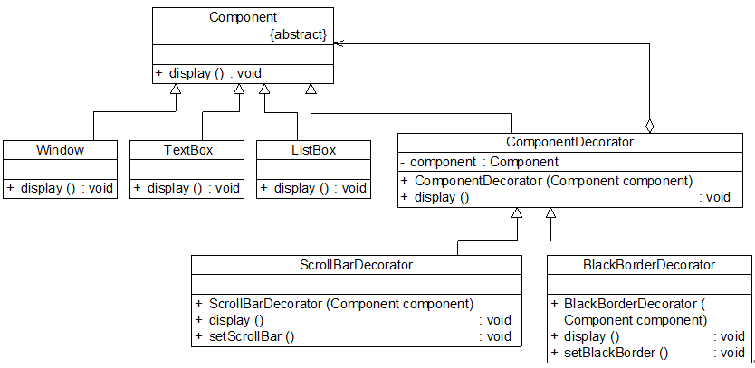

扩展系统功能——装饰器模式

# 生活中的例子：

尽管目前房价依旧很高，但还是阻止不了大家对新房的渴望和买房的热情。如果大家买的是毛坯房，无疑还有一项艰巨的任务要面对，那就是装修。对新房进行装修并没
有改变房屋用于居住的本质，但它可以让房子变得更漂亮、更温馨、更实用、更能满足居家的需求。在软件设计中，我们也有一种类似新房装修的技术可以对已有对象（新房）
的功能进行扩展（装修），以获得更加符合用户需求的对象，使得对象具有更加强大的功能。这种技术对应于一种被称之为装饰模式的设计模式，本章将介绍用于扩展系统功能的装饰模式。

# 实战项目

## 图形界面构件库的设计

unny软件公司基于面向对象技术开发了一套图形界面构件库VisualComponent，该构件库提供了大量基本构件，**如窗体、文本框、列表框等**，由于在使用该构件库时，
用户经常要求定制一些特效显示效果，如带滚动条的窗体、带黑色边框的文本框、既带滚动条又带黑色边框的列表框等等，因此经常需要对该构件库进行扩展以增强其功能，如图所示：
如何提高图形界面构件库性的可扩展性并降低其维护成本是Sunny公司开发人员必须面对的一个问题。


## 初始方案：继承复用


分析上面的继承复用设计方案，不难发现有如下缺点：

(1) 系统扩展麻烦，在某些编程语言中无法实现。
图中存在大量多重继承，但是现在的面向对象语言大多不支持多重继承，如Java。这直接寄。

(2) 代码重复。
图中可以看见到第三层继承关系时，已经出现每一个对象需要重复实现相同的方法了，这造成大量代码重复。

(3) 系统庞大，类的数目非常多。
这一目了然。如果在增加一个基本行为，比如放大功能，那会直接增加3个类。

## 改进：

根据“**合成复用原则**”，在实现功能复用时，我们要**多用关联，少用继承**，因此我们可以换个角度来考虑，将setScrollBar()
方法抽取出来，封装在一个独立的类中，
在这个类中定义一个Component类型的对象，通过调用Component的display()方法来显示最基本的构件，同时再通过setScrollBar()
方法对基本构件的功能进行增强。
由于Window、ListBox和TextBox都是Component的子类，根据“里氏代换原则”，程序在运行时，我们只要向这个独立的类中注入具体的Component子类的对象即可实现功能的扩展。
**这个独立的类一般称为装饰器(Decorator)或装饰类**，顾名思义，**它的作用就是对原有对象进行装饰，通过装饰来扩展原有对象的功能**。

---

## 改进方案：装饰器模式

### 定义：

装饰模式(Decorator Pattern)：**动态地给一个对象增加一些额外的职责，就增加对象功能来说，装饰模式比生成子类实现更为灵活**
。装饰模式是一种对象结构型模式。

### 结构图：

在装饰模式中，为了让系统具有更好的灵活性和可扩展性，我们通常会定义一个抽象装饰类，而将具体的装饰类作为它的子类，装饰模式结构：


包含角色：

● Component（抽象构件）：[毛坯房和装修物品的共同祖先]**它是具体构件和抽象装饰类的共同父类**，声明了在具体构件中实现的业务方法，
**它的引入可以使客户端以一致的方式处理未被装饰的对象以及装饰之后的对象，实现客户端的透明操作**。

● ConcreteComponent（具体构件）：[相当于毛坯房]**它是抽象构件类的子类，用于定义具体的构件对象**，实现了在抽象构件中声明的方法，
**装饰器可以给它增加额外的职责（方法）**。

● Decorator（抽象装饰类）：[装修物品父类]
它也是抽象构件类的子类，用于给具体构件增加职责，但是具体职责在其子类中实现。它维护一个指向抽象构件对象的引用，通过该引用可以调用装饰之前构件对象的方法，并通过其子类扩展该方法，以达到装饰的目的。

● ConcreteDecorator（具体装饰类）：[具体装修物品]
它是抽象装饰类的子类，负责向构件添加新的职责。每一个具体装饰类都定义了一些新的行为，它可以调用在抽象装饰类中定义的方法，并可以增加新的方法用以扩充对象的行为。
由于具体构件类和装饰类都实现了相同的抽象构件接口，因此装饰模式以对客户透明的方式动态地给一个对象附加上更多的责任，**换言之，客户端并不会觉得对象在装饰前和装饰后有什么不同**。装饰模式可以在不需要创造更多子类的情况下，将对象的功能加以扩展。

---
核心：抽象装饰类：
### 典型代码：
**抽象装饰类:**

在抽象装饰类Decorator中定义了一个Component类型的对象component，维持一个对抽象构件对象的引用，并可以通过构造方法或Setter方法将一个Component类型
的对象注入进来[也就是具体构构件呗，也就是毛呸房]，同时由于Decorator类实现了抽象构件Component接口，**因此需要实现在其中声明的业务方法operation()**，需要注意的是在Decorator中并未
真正实现operation()方法，而只是调用原有component对象的operation()方法，**它没有真正实施装饰，而是提供一个统一的接口，将具体装饰过程交给子类完成**。

```java
class Decorator implements Component {

    private Component component;  //维持一个对抽象构件对象的引用

    public Decorator(Component component)  //注入一个抽象构件类型的对象
    {
        this.component = component;     
    }
    public void operation() {

        component.operation();  //调用原有业务方法。交给具体装饰类来调用。
    }
}
```

**具体装饰类：**
```java
class ConcreteDecorator extends Decorator {

    public ConcreteDecorator(Component component) {
        super(component);//实现注入了具体构件，直接诶调用的父类的构造方法
    }
    public void operation() {
        super.operation();  //调用原有业务方法
        addedBehavior();  //调用新增业务方法
    }
    //新增业务方法
    public void addedBehavior() {    
         //……
    }
}
```
由于在抽象装饰类Decorator中注入的是Component类型的对象，**因此我们可以将一个具体构件对象注入其中，再通过具体装饰类来进行装饰**；
此外，我们还可以将一个已经装饰过的Decorator子类的对象再注入其中进行多次装饰，从而对原有功能的多次扩展。

---

# 完整解决方案

为了让系统具有更好的灵活性和可扩展性，克服继承复用所带来的问题，Sunny公司开发人员使用装饰模式来重构图形界面构件库的设计，其中部分类的基本结构如图12-4所示：



Component充当抽象构件类，其子类Window、TextBox、ListBox充当具体构件类，Component类的另一个子类ComponentDecorator充当抽象装饰类，
ComponentDecorator的子类ScrollBarDecorator和BlackBorderDecorator充当具体装饰类。完整代码如下所示：

// 如果需要在原有系统中增加一个新的具体构件类或者新的具体装饰类，无须修改现有类库代码，只需将它们分别作为**抽象构件类或者抽象装饰类的子类**即可。
// 与图12-2所示的继承结构相比，使用装饰模式之后将大大减少了子类的个数，让系统扩展起来更加方便，而且更容易维护，是取代继承复用的有效方式之一。


# 装饰模式注意事项

(1) 尽量保持装饰类的接口与被装饰类的接口相同，这样，对于客户端而言，无论是装饰之前的对象还是装饰之后的对象都可以一致对待。
    **这也就是说，在可能的情况下，我们应该尽量使用透明装饰模式**。

(2) 尽量保持具体构件类ConcreteComponent**是一个“轻”类**，也就是说不要把太多的行为放在具体构件类中，我们可以通过装饰类对其进行扩展。

(3) **如果只有一个具体构件类，那么抽象装饰类可以作为该具体构件类的直接子类**。如图12-6所示：


# 装饰模式总结
## 概总：
装饰模式降低了系统的耦合度，可以动态增加或删除对象的职责，并使得需要装饰的具体构件类和具体装饰类可以独立变化，以便增加新的具体构件类和具体装饰类。
在软件开发中，装饰模式应用较为广泛，例如在JavaIO中的输入流和输出流的设计、javax.swing包中一些图形界面构件功能的增强等地方都运用了装饰模式。

1.主要优点

(1) 对于扩展一个对象的功能，装饰模式比继承更加灵活性，不会导致类的个数急剧增加。

(2) 可以通过一种动态的方式来扩展一个对象的功能，通过配置文件可以在运行时选择不同的具体装饰类，从而实现不同的行为。

(3) 可以对一个对象进行多次装饰，通过使用不同的具体装饰类以及这些装饰类的排列组合，可以创造出很多不同行为的组合，得到功能更为强大的对象。

(4) 具体构件类与具体装饰类可以独立变化，用户可以根据需要增加新的具体构件类和具体装饰类，原有类库代码无须改变，符合“开闭原则”。

---
2.主要缺点


(1) 使用装饰模式进行系统设计时**将产生很多小对象**，这些对象的区别在于它们之间相互连接的方式有所不同，而不是它们的类或者属性值有所不同，大量小对象的产生势必会占用更多的系统资源，在一定程序上影响程序的性能。

(2) 装饰模式提供了一种比继承更加灵活机动的解决方案，但同时也意味着比继承更加易于出错，排错也很困难，对于多次装饰的对象，**调试时寻找错误可能需要逐级排查，较为繁琐**。

---
3.适用场景

(1) 在不影响其他对象的情况下，以动态、透明的方式给单个对象添加职责。

(2) 当不能采用继承的方式对系统进行扩展或者采用继承不利于系统扩展和维护时可以使用装饰模式。 
    不能采用继承的情况主要有两类：
1. 第一类是系统中存在大量独立的扩展， 为支持每一种扩展或者扩展之间的组合将产生大量的子类，使得子类数目呈爆炸性增长；
2. 第二类是因为类已定义为不能被继承（如Java语言中的final类）。

