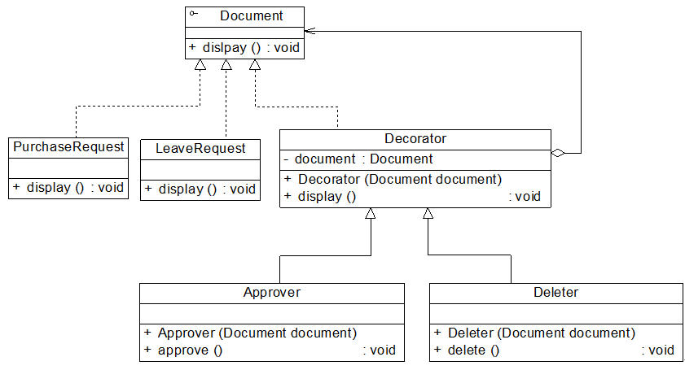

# 透明装饰模式与半透明装饰模式
## 问题引出：
之前的装饰模式存在一个问题：
如果客户端希望单独调用具体装饰类新增的方法，而不想通过抽象构件中声明的方法来调用新增方法时将遇到一些麻烦，我们通过一个实例来对这种情况加以说明：

## 项目：
在Sunny软件公司开发的Sunny OA系统中，采购单(PurchaseRequest)和请假条(LeaveRequest)等文件(Document)对象都具有显示功能，现在要为其增加审批、删除等功能，使用装饰模式进行设计。


Document充当抽象构件类，PurchaseRequest和LeaveRequest充当具体构件类，Decorator充当抽象装饰类，Approver和Deleter充当具体装饰类。其中Decorator类和Approver类的示例代码如下所示:

```java
//抽象装饰类
class Decorator implements Document {
    private Document document;
    
    public Decorator(Document document) {
        this.document = document;
    }
    public void display() {
        document.display();
    }
}

//具体装饰类
class Approver extends Decorator {
    public Approver(Document document) {
        super(document);
        System.out.println("增加审批功能！");
    }
    public void approve() {
        System.out.println("审批文件！");
    }
}
```
大家注意，Approver类继承了抽象装饰类Decorator的display()方法，同时新增了业务方法approve()，**但这两个方法是独立的，没有任何调用关系**。
如果客户端需要分别调用这两个方法，代码片段如下所示：

Document  doc; //使用抽象构件类型定义
doc = new PurchaseRequest();
Approver newDoc; //使用具体装饰类型定义
newDoc = new Approver(doc);
newDoc.display();//调用原有业务方法
newDoc.approve();//调用新增业务方法

如果newDoc也使用Document类型来定义，将导致客户端无法调用新增业务方法approve()，因为在抽象构件类Document中没有对approve()方法的声明。 也就是说，在客户端无法统一对待装饰之前的具体构件对象和装饰之后的构件对象。
在实际使用过程中，**由于新增行为可能需要单独调用，因此这种形式的装饰模式也经常出现，这种装饰模式被称为半透明(Semi-transparent)装饰模式**， **而标准的装饰模式是透明(Transparent)装饰模式**。下面我们对这两种装饰模式进行较为详细的介绍：

---
# (1)透明装饰模式

在透明装饰模式中，要求客户端完全针对抽象编程，装饰模式的透明性要求客户端程序不应该将对象声明为具体构件类型或具体装饰类型，**而应该全部声明为抽象构件类型**。
对于客户端而言，具体构件对象和具体装饰对象没有任何区别。也就是应该使用如下代码：
---
Component  c, c1; //使用抽象构件类型定义对象
c = new ConcreteComponent()；
c1 = new ConcreteDecorator (c)；
---
使用抽象构件类型Component定义全部具体构件对象和具体装饰对象，客户端可以一致地使用这些对象，因此符合透明装饰模式的要求。
透明装饰模式可以让客户端透明地使用装饰之前的对象和装饰之后的对象，无须关心它们的区别，此外，还可以对一个已装饰过的对象进行多次装饰，得到更为复杂、功能更为强大的对象。
在实现透明装饰模式时，要求具体装饰类的operation()方法覆盖抽象装饰类的operation()方法，**除了调用原有对象的operation()外还需要调用新增的addedBehavior()方法来增加新行为**。


# (2)半透明装饰模式

透明装饰模式的设计难度较大，而且有时我们需要单独调用新增的业务方法。为了能够调用到新增方法，我们不得不用具体装饰类型来定义装饰之后的对象，
而具体构件类型还是可以使用抽象构件类型来定义，这种装饰模式即为半透明装饰模式，也就是说，对于客户端而言，具体构件类型无须关心，是透明的；
但是具体装饰类型必须指定，这是不透明的。如本节前面所提到的文件对象功能增加实例，**为了能够调用到在Approver中新增方法approve()**，客户端代码片段如下所示：
---
……
Document  doc; //使用抽象构件类型定义

doc = new PurchaseRequest();

Approver newDoc; //使用具体装饰类型定义

newDoc = new Approver(doc);

……
---
半透明装饰模式可以给系统带来更多的灵活性，设计相对简单，使用起来也非常方便；**但是其最大的缺点在于不能实现对同一个对象的多次装饰**，**而且客户端需要有区别地对待装饰之前的对象和装饰之后的对象**。
在实现半透明的装饰模式时，我们只需在具体装饰类中增加一个独立的addedBehavior()方法来封装相应的业务处理，由于客户端使用具体装饰类型来定义装饰后的对象，因此可以单独调用addedBehavior()方法来扩展系统功能。
