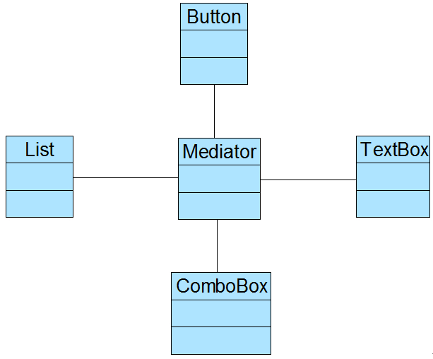
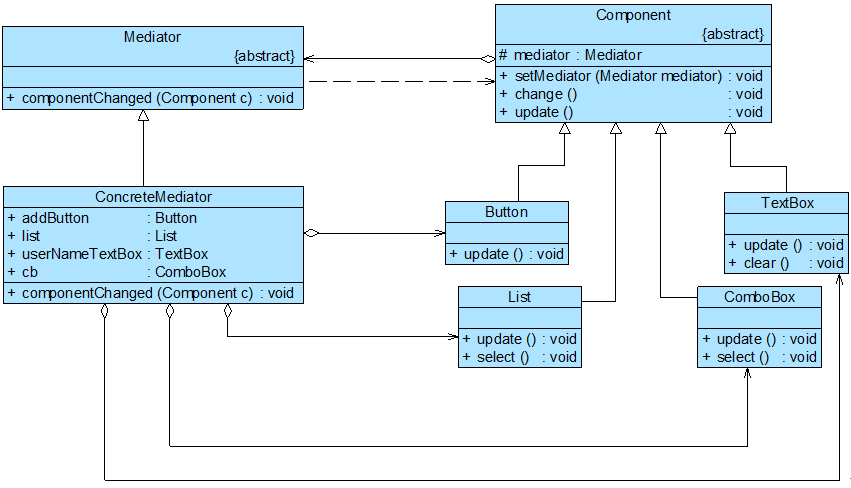

#  通过中介者类进行改写项目
为了协调界面组件对象之间的复杂交互关系，Sunny公司开发人员使用中介者模式来设计客户信息管理窗口，其结构示意图如图20-7所示:

图20-7只是一个重构之后的结构示意图，在具体实现时，为了确保系统具有更好的灵活性和可扩展性，我们需要`定义抽象中介者和抽象组件类`，其中抽象组件类是所有具体组件类的公共父类，完整类图如图20-8所示：

上图中，Component充当抽象同事类，Button、List、ComboBox和TextBox充当具体同事类，Mediator充当抽象中介者类，ConcreteMediator充当具体中介者类，
ConcreteMediator维持了对具体同事类的引用，为了简化ConcreteMediator类的代码，我们在其中只定义了一个Button对象和一个TextBox对象。完整代码如下所示：

