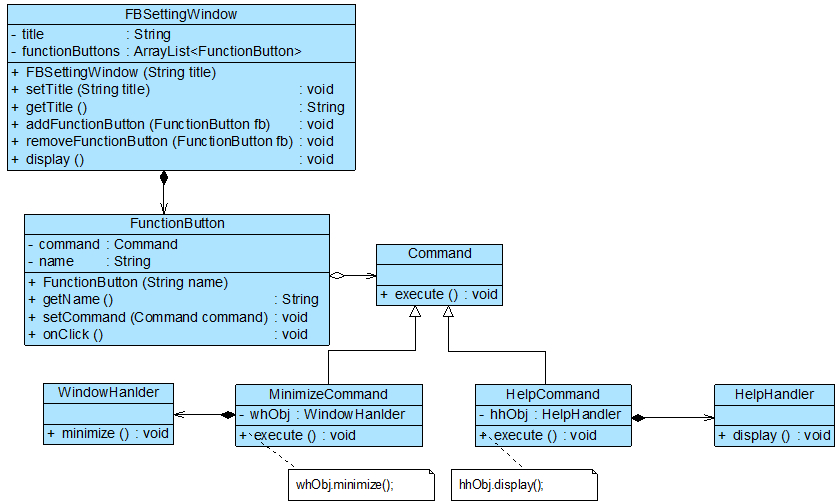

# 完整解决方案
       为了降低功能键与功能处理类之间的耦合度，让用户可以自定义每一个功能键的功能，Sunny软件公司开发人员使用命令模式来设计“自定义功能键”模块，其核心结构如图4所示：


FBSettingWindow是“功能键设置”界面类，FunctionButton充当请求调用者，Command充当抽象命令类，MinimizeCommand和HelpCommand充当**具体命令类**，
WindowHanlder和HelpHandler充当请求接收者。

`即命令调用者是命令发起者与命令接受者之间的桥梁`

# 命令队列
## 背景
有时候我们需要将多个请求排队，当一个请求发送者发送一个请求时，将不止一个请求接收者产生响应，这些请求接收者将逐个执行业务方法，完成对请求的处理。
此时，我们可以通过命令队列来实现。

## 实现方式
命令队列的实现方法有多种形式，其中最常用、灵活性最好的一种方式是增加一个CommandQueue类，由该类来负责存储多个命令对象，而不同的命令对象可以对应
不同的请求接收者，CommandQueue类的典型代码如下所示：

```java
import java.util.*;
 
class CommandQueue {
    //定义一个ArrayList来存储命令队列
	private ArrayList<Command> commands = new ArrayList<Command>();
	
	public void addCommand(Command command) {
		commands.add(command);
	}
	
	public void removeCommand(Command command) {
		commands.remove(command);
	}
	
    //循环调用每一个命令对象的execute()方法
	public void execute() {
		for (Object command : commands) {
			((Command)command).execute();
		}
	}
}
```

## Invoker类
在增加了命令队列类CommandQueue以后，请求发送者类Invoker将·`针对CommandQueue编程`，代码修改如下：

```java
class Invoker {
	private CommandQueue commandQueue; //维持一个CommandQueue对象的引用
	
    //构造注入
	public Invoker(CommandQueue commandQueue) {
		this. commandQueue = commandQueue;
	}
	
    //设值注入
	public void setCommandQueue(CommandQueue commandQueue) {
		this.commandQueue = commandQueue;
	}
	
	//调用CommandQueue类的execute()方法
	public void call() {
		commandQueue.execute();
	}
}
```

## 批处理
命令队列与我们常说的`“批处理”`有点类似。批处理，顾名思义，可以对一组对象（命令）进行批量处理，当一个发送者发送请求后，将有一系列接收者对请求作出响应，
命令队列可以用于设计批处理应用程序，如果请求接收者的接收次序没有严格的先后次序，**我们还可以使用多线程技术来并发调用命令对象的execute()方法，从而提高程序的执行效率**。


