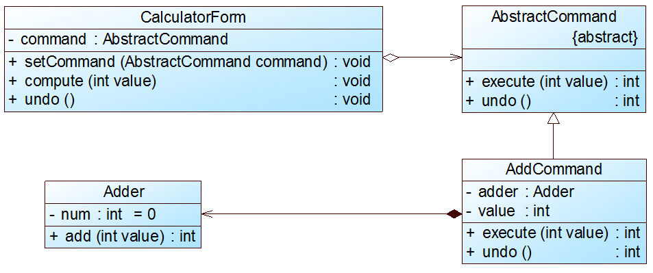

# 撤销操作的实现

## 背景
在命令模式中，我们可以通过调用一个命令对象的execute()方法来实现对请求的处理，如果需要撤销(Undo)请求，可通过在命令类中增加一个逆向操作来实现。

## 扩展
除了通过一个逆向操作来实现撤销(Undo)外，还可以通过**保存对象的历史状态来实现撤销，后者可使用备忘录模式(Memento Pattern)来实现**。

## 命令模式实现撤销操作

Sunny软件公司开发人员使用命令模式设计了如图5所示结构图，其中计算器界面类CalculatorForm充当请求发送者，实现了数据求和功能的加法类Adder充当请求接收者，
界面类可间接调用加法类中的add()方法实现加法运算，并且提供了可撤销加法运算的undo()方法。

完整代码见测栏

需要注意的是在本实例中只能实现一步撤销操作，`因为没有保存命令对象的历史状态`，可以通过引入·`一个命令集合或其他方式来存储每一次操作时命令的状态·`，
从而实现·`·多次撤销操作`。除了Undo操作外，还可以采用类似的方式`实现恢复(Redo)`操作，即恢复所撤销的操作（或称为`二次撤销`）。

