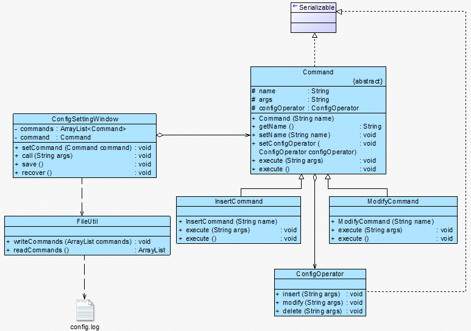

# 6 请求日志
## 日志的概述

请求日志**就是将请求的历史记录保存下来**，通常以**日志文件(Log File)的形式永久存储在计算机中**。很多系统都提供了日志文件，例如Windows日志文件、Oracle日志文件等，
**日志文件可以记录用户对系统的一些操作（例如对数据的更改）**。请求日志文件可以实现很多功能，常用功能如下：

(1) “天有不测风云”，一旦系统发生故障，日志文件可以`为系统提供一种恢复机制`，在请求日志文件中可以记录用户对系统的每一步操作，从而让系统能够顺利恢复`到某一个特定的状态`；

(2) 请求日志也可以用于`实现批处理`，在一个请求日志文件中可以`存储一系列命令对象`，例如一个命令队列；

(3) 可以将命令队列中的`所有命令对象都存储在一个日志文件中`，每执行一个命令则从日志文件中删除一个对应的命令对象，`防止因为断电或者系统重启等原因造成请求丢失`，
    而且可以避免重新发送全部请求时造成某些命令的重复执行，只需读取请求日志文件，再继续执行文件中剩余的命令即可。
---

在实现请求日志时，我们可以将命令对象通过序列化写到日志文件中，此时命令类必须实现java.io.Serializable接口。
下面我们通过一个简单实例来说明日志文件的用途以及如何实现请求日志：

##  实战——网站；配置文件增删改查

>现在Sunny软件公司开发人员希望将对配置文件的操作请求记录在日志文件中，如果网站重新部署，只需要执行保存在日志文件中的命令对象即可修改配置文件。

