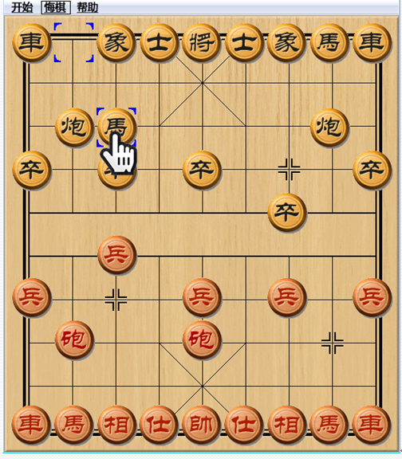
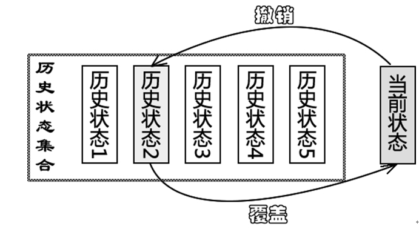

本章将介绍一种让我们可以在软件中实现后悔机制的设计模式——备忘录模式，它是软件中的“后悔药”
# 备忘录模式——撤销功能的实现

## 可悔棋的中国象棋

Sunny软件公司欲开发一款可以运行在Android平台的触摸式中国象棋软件，由于考虑到有些用户是“菜鸟”，经常不小心走错棋；还有些用户因为不习惯使用手指在手机屏幕上拖动棋子，
常常出现操作失误，因此该中国象棋软件要提供“悔棋”功能，用户走错棋或操作失误后可恢复到前一个步骤。：

如何实现“悔棋”功能是Sunny软件公司开发人员需要面对的一个重要问题，“悔棋”就是让`系统恢复到某个历史状态`，在很多软件中通常称之为`“撤销”`。下面我们来简单分析一下撤销功能的实现原理：
在实现撤销时，首先`必须保存软件系统的历史状态`，当用户需要取消错误操作并且返回到某个历史状态时，可以取出`事先保存`的历史状态来`覆盖`当前状态。如图21-2所示：

备忘录模式正为·`解决此类撤销问题而诞生`，它为我们的软件提供了“后悔药”，通过使用备忘录模式可以`使系统恢复到某一特定的历史状态`。

