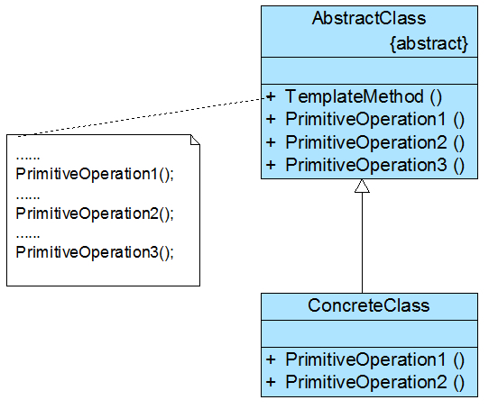

# 生活例子——请客吃饭

在现实生活中，很多事情都包含几个实现步骤，例如请客吃饭，无论吃什么，一般都包含点单、吃东西、买单等几个步骤，通常情况下这几个步骤的次序是：`点单 --> 吃东西 --> 买单`。
在这三个步骤中，`点单和买单大同小异，最大的区别在于第二步——吃什么`？吃面条和吃满汉全席可大不相同

# 引出模板方法
在软件开发中，有时也会遇到类似的情况，某个方法的实现`需要多个步骤（类似“请客”）`，其中`有些步骤是固定的`（类似“点单”和“买单”），而`有些步骤并不固定`，存在可变性（类似“吃东西”）。
为了提高代码的复用性和系统的灵活性，可以使用一种称之为模板方法模式的设计模式来对这类情况进行设计。

----
在模板方法模式中，将实现功能的`每一个步骤所对应的方法`称`为基本方法` （例如“点单”、“吃东西”和“买单”），而`调用`这些基本方法同时定义基本方法的`执行次序`的方法称为`模板方法`（例如“请客”）。
在模板方法模式中，可以将相同的代码放在父类中， 例如将模板方法“请客”以及基本方法“点单”和“买单”的实现放在父类中，而对于基本方法“吃东西”，在父类中`只做一个声明`，
将其具体实现放在不同的子类中，在一个子类中提供“吃面条”的实现， 而另一个子类提供“吃满汉全席”的实现。
通过使用模板方法模式，一方面提高了代码的复用性， 另一方面还可以利用面向对象的多态性，在运行时选择一种具体子类，实现完整的“请客”方法， 提高系统的灵活性和可扩展性。

# 模板方法模式定义
模板方法模式： 定义一个操作中`算法的框架`，而将一些步骤`延迟`到子类中。模板方法模式使`得子类可以不改变一个算法的结构`即可`重定义`该算法的某些特定步骤。
模板方法模式是一种`基于继承的代码复用技术`，它是一种类行为型模式。

-----
## 地位

模板方法模式是结构`最简单`的行为型设计模式，在其结构中`只存在`父类与子类之间的`继承关系`。
通过使用模板方法模式，可以将一些复杂流程的实现步骤封装在一系列基本方法中， 在抽象父类中提供一个称之为模板方法的方法来定义这些基本方法的`执行次序`，
而`通过其子类来覆盖某些步骤`，从而使得相同的算法框架可以有不同的执行结果。 模板方法模式提供了一个`模板方法`来定义算法框架，而某些具体步骤的实现可以在其子类中完成。

-----
# 模板方法结构图
//只有继承关系的设计模式，最简单的一种！！

## 组成角色

(1) `AbstractClass（抽象类）`：在抽象类中定义了一系列基本操作(Primitive Operations)，这些基本操作可以是具体的，也可以是抽象的，**每一个基本操作对应算法的一个步骤**，
    在**其子类中可以重定义或实现这些步骤**。同时，在抽象类中实现了一个模板方法(Template Method)，**用于定义一个算法的框架**，模板方法不仅可以调用在抽象类中实现的基本方法， 
    也可以调用在抽象类的子类中实现的基本方法，还可以调用其他对象中的方法。

(2)` ConcreteClass（具体子类）`：它是抽象类的子类，用于`实现`在父类中声明的抽象基本操作以完成子类特定算法的步骤，也可以`覆盖`在父类中已经实现的具体基本操作。


## 模式实现

在实现模板方法模式时，开发抽象类的软件设计师和开发具体子类的软件设计师之间可以进行协作。
一个设计师负责给出`一个算法的轮廓和框架`，另一些设计师则负责给出这个`算法的各个逻辑步骤`。
实现这些具体逻辑步骤的方法即为`基本方法`，而将这些基本方法汇总起来的方法即为`模板方法`，模板方法模式的名字也因此而来。

-----
## 基本算法分类

基本方法又可以分为三种：

(1) 抽象方法：一个抽象方法由抽象类声明、由其具体子类实现。在C#语言里一个抽象方法以abstract关键字标识。

(2) 具体方法：一个具体方法由一个抽象类或具体类声明并实现，其子类可以进行覆盖也可以直接继承。

(3) 钩子方法：一个钩子方法由一个抽象类或具体类声明并实现，而其子类可能会加以扩展。通常在父类中给出的实现是一个空实现，并以该空实现作为方法的默认实现，当然钩子方法也可以提供一个非空的默认实现。
    
    3.1 与具体步骤挂钩的钩子方法

    实现在不同条件下执行模板方法中的不同步骤，这类钩子方法的返回类型通常是bool类型的，这类方法名一般为IsXXX()，用于对某个条件进行判断，如果条件满足则执行某一步骤，否则将不执行，如下代码片段所示：
```java
//模板方法
public void TemplateMethod() {
    Open();
    Display();
//通过钩子方法来确定某步骤是否执行
    if (IsPrint()) {
        Print();
    }
}

//钩子方法
public bool IsPrint() {
    return true;
}

```

    3.2 实现体为空的具体方法(钩子方法)

子类可以`根据需要覆盖或者继承这些钩子方法`，与抽象方法相比，这类钩子方法的好处在于子类如果没有覆盖父类中定义的钩子方法，编译可以正常通过，但是如果没有覆盖父类中声明的抽象方法，编译将报错。
```java
abstract class AbstractClass {
    //模板方法
    public void TemplateMethod() {
        PrimitiveOperation1();
        PrimitiveOperation2();
        PrimitiveOperation3();
    }

    //基本方法—具体方法
    public void PrimitiveOperation1() {
        //实现代码
    }

    //基本方法—抽象方法
    public abstract void PrimitiveOperation2();

    //基本方法—钩子方法
    public void PrimitiveOperation3() {
    }
}
```

子类的典型代码
```java
class ConcreteClass extends AbstractClass {
    @Override
    public void PrimitiveOperation2() {
        //实现代码
    }
    
    @Override
    public void PrimitiveOperation3() {
        //实现代码
    }
}
```


