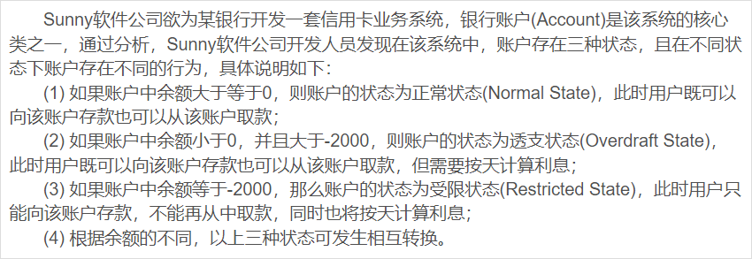
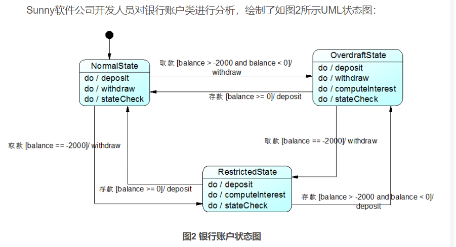

# 状态模式
## 生活中的例子
“人有悲欢离合，月有阴晴圆缺”，包括人在内，`[很多事物都具有多种状态]`，而且`在不同状态下会具有不同的行为`，这些状态`在特定条件下还将发生相互转换`。
就像水，它可以凝固成冰，也可以受热蒸发后变成水蒸汽，水可以流动，冰可以雕刻，蒸汽可以扩散。

## 软件中的状态模式
在软件系统中，有些对象也像水一样具有多种状态，这些状态在某些情况下能够相互转换，而且对象在不同的状态下也将具有不同的行为。为了更好地对这些具有多种
状态的对象进行设计，我们可以使用一种被称之为状态模式的设计模式，本章我们将学习用于描述对象状态及其转换的状态模式。

## 银行初始项目



## 初始代码
NormalState表示正常状态，OverdraftState表示透支状态，RestrictedState表示受限状态，在这三种状态下账户对象拥有不同的行为，方法deposit()用于存款，
withdraw()用于取款，computeInterest()用于计算利息，stateCheck()用于在每一次执行存款和取款操作后根据余额来判断是否要进行状态转换并实现状态转换，
相同的方法在不同的状态中可能会有不同的实现。为了实现不同状态下对象的各种行为以及对象状态之间的相互转换，Sunny软件公司开发人员设计了一个较为庞大的账户类Account，
其中部分代码如下所示：

```java
class Account {
    private String state; //状态
    private int balance; //余额
    //......

    //存款操作	
    public void deposit() {
        //存款
        stateCheck();
    }

    //取款操作
    public void withdraw() {
        if (state.equalsIgnoreCase("NormalState1") || state.equalsIgnoreCase("OverdraftState ")) {
            //取款
            stateCheck();
        } else {
            //取款受限
        }
    }

    //计算利息操作
    public void computeInterest() {
        if (state.equalsIgnoreCase("OverdraftState") || state.equalsIgnoreCase("RestrictedState ")) {
            //计算利息
        }
    }

    //状态检查和转换操作
    public void stateCheck() {
        if (balance >= 0) {
            state = "NormalState1";
        } else if (balance > -2000 && balance < 0) {
            state = "OverdraftState";
        } else if (balance == -2000) {
            state = "RestrictedState";
        } else if (balance < -2000) {
            //操作受限
        }
    }
    //......
}
```

## 初始代码存在的问题

分析上述代码，我们不难发现存在如下几个问题：

       (1) 几乎每个方法中都包含状态判断语句，以判断在该状态下是否具有该方法以及在特定状态下该方法如何实现，导致代码非常冗长，可维护性较差；

       (2) 拥有一个较为复杂的stateCheck()方法，包含大量的if…else if…else…语句用于进行状态转换，代码测试难度较大，且不易于维护；

       (3) 系统扩展性较差，如果需要增加一种新的状态，如冻结状态（Frozen State1，在该状态下既不允许存款也不允许取款），需要对原有代码进行大量修改，扩展起来非常麻烦。
       为了解决这些问题，我们可以使用状态模式，在状态模式中，我们将对象在每一个状态下的行为和状态转移语句封装在一个个状态类中，通过这些状态类来分散冗长的条件转移语句，
       让系统具有更好的灵活性和可扩展性，状态模式可以在一定程度上解决上述问题。


