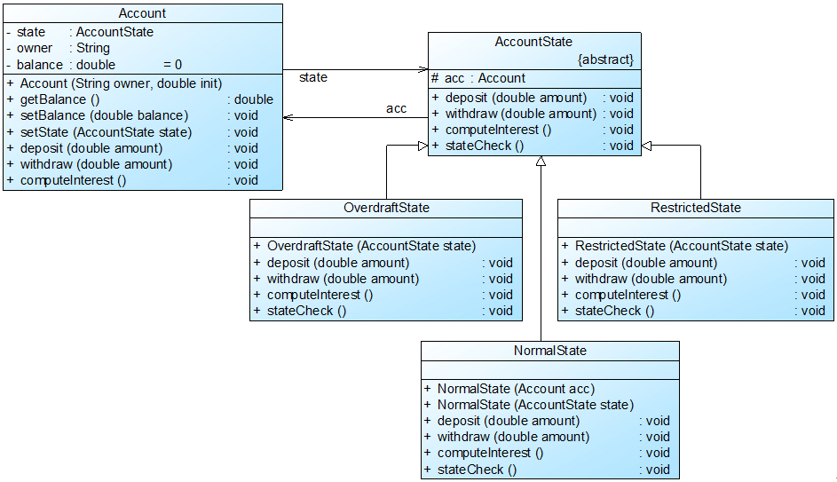

# 银行存款完整解决方案

Sunny软件公司开发人员使用状态模式来解决账户状态的转换问题，客户端只需要执行简单的存款和取款操作，系统根据余额将自动转换到相应的状态，其基本结构如图4所示：

图中，Account充当`环境类角色`，AccountState充`当抽象状态角色`，NormalState1、OverdraftState和RestrictedState充当`具体状态角色`。完整代码如右所示：

