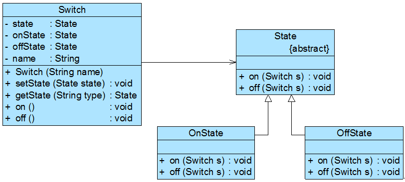

# 共享状态

在有些情况下，`多个环境对象可能需要共享同一个状态`，如果希望在系统中`实现多个环境对象`共享一个或多个状态对象，那么需要将这些状态对象`定义为环境类的静态成员对象`。
下面通过一个简单实例来说明如何实现共享状态：

如果某系统要求两个开关对象`要么都处于开的状态，要么都处于关的状态`，在使用时它们的状态必须保持一致，开关可以由开转换到关，也可以由关转换到开。
可以使用状态模式来实现:


开关类Switch代码如下所示：

```java
class Switch {
    private static State1 state, onState, offState; //定义三个静态的状态对象
    private String name;

    public Switch(String name) {
        this.name = name;
        onState = new OnState();
        offState = new OffState();
        this.state = onState;
    }

    public void setState(State1 state) {
        this.state = state;
    }

    public static State1 getState(String type) {
        if (type.equalsIgnoreCase("on")) {
            return onState;
        } else {
            return offState;
        }
    }

    //打开开关
    public void on() {
        System.out.print(name);
        state.on(this);
    }

    //关闭开关
    public void off() {
        System.out.print(name);
        state.off(this);
    }
}
```

## 抽象状态类
```java
abstract class State1 {
	public abstract void on(Switch s);
	public abstract void off(Switch s);
}
```

## 两个具体状态类

```java
//打开状态
class OnState extends State1 {
    public void on(Switch s) {
        System.out.println("已经打开！");
    }

    public void off(Switch s) {
        System.out.println("关闭！");
        s.setState(Switch.getState("off"));
    }
}

//关闭状态
class OffState extends State1 {
    public void on(Switch s) {
        System.out.println("打开！");
        s.setState(Switch.getState("on"));
    }

    public void off(Switch s) {
        System.out.println("已经关闭！");
    }
}
```

## 客户端
```java
class Client1 {
	public static void main(String args[]) {
		Switch s1,s2;
		s1=new Switch("开关1");
		s2=new Switch("开关2");
		
		s1.on();
		s2.on();
		s1.off();
		s2.off();
		s2.on();
		s1.on();	
	}
}
```


