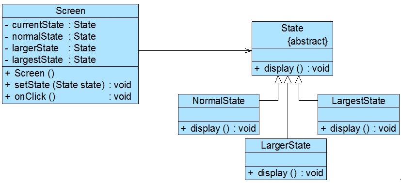

# 使用环境类实现状态转换

在状态模式中实现状态转换时，具体状态类可通过`调用环境类`Context的setState()方法进行状态的转换操作，也可以统一`由环境类Context来实现状态的转换`。
此时，增加新的具体状态类可能需要修改其他具体状态类或者环境类的源代码，否则系统无法转换到新增状态。但是对于客户端来说，无须关心状态类，可以为环境类设置默认的状态类，
而将状态的转换工作交给具体状态类或环境类来完成，具体的转换细节对于客户端而言是透明的。

在上面的“银行账户状态转换”实例中，`我们通过具体状态类来实现状态的转换`，在每一个具体状态类中都包含一个stateCheck()方法，在该方法内部实现状态的转换，
`除此之外，我们还可以通过环境类来实现状态转换`，环境类作为一个状态管理器，统一实现各种状态之间的转换操作。

下面通过一个包含循环状态的简单实例来说明如何使用环境类实现状态转换：

## 项目介绍

Sunny软件公司某开发人员欲开发一个屏幕放大镜工具，其具体功能描述如下：

用户单击“放大镜”按钮之后屏幕将放大一倍，再点击一次“放大镜”按钮屏幕再放大一倍，第三次点击该按钮后屏幕将还原到默认大小。{很贴近现实了哈哈！！！}

可以考虑使用状态模式来设计该屏幕放大镜工具，我们定义三个屏幕状态类`NormalState1、LargerState和LargestState`来对应屏幕的三种状态，
分别是正常状态、二倍放大状态和四倍放大状态，`屏幕类Screen充当环境类`，其结构如图6所示：

代码如右：：

