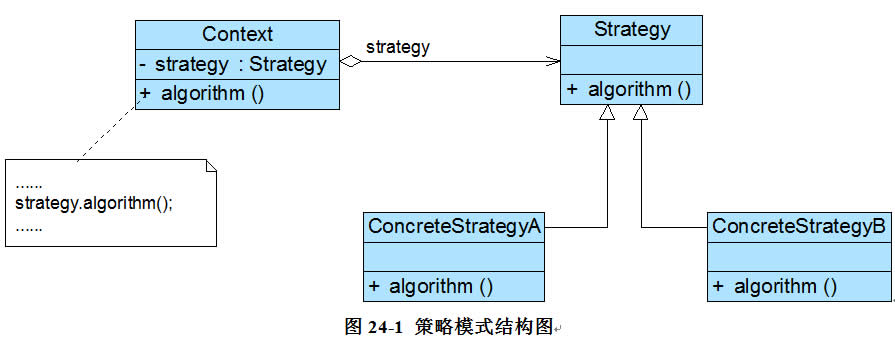

# 策略模式

在策略模式中，我们可以定义一些`独立的类来封装不同的算法`
，每一个类封装一种具体的算法，在这里，`每一个封装算法的类我们都可以称之为一种策略`(Strategy)，
为了保证这些策略在使用时`具有一致性`，一般会提供一个抽象的策略类来做规则的定义，而每种算法则对应于一个`具体策略类`。

## 目的

策略模式的`主要目的是将算法的定义与使用分开`，也就是`将算法的行为和环境分开`
，将算法的定义放在专门的策略类中，每一个策略类封装了一种实现算法，使用算法的环境类针对抽象策略类进行编程，
符合`“依赖倒转原则”`。在出现新的算法时，只需要`增加一个新的实现`了抽象策略类的具体策略类即可。策略模式定义如下：

## 策略模式定义

定义一系列算法类，将每一个算法封装起来，并让它们可以`相互替换`，策略模式让算法独立于使用它的客户而变化，也称为`政策模式`(
Policy)。策略模式是一种对象行为型模式。

## 结构图



## 角色及典型代码

包含角色：

● Context（环境类）：环境类是`使用算法的角色`，它在解决某个问题（即实现某个方法）时可以`采用多种策略`
。在环境类中维持一个`对抽象策略类的引用实例`，用于定义所采用的策略。
在一个系统中`可以存在多个环境类`，它们可能需要重用一些相同的算法。

```java
class Context {
    private AbstractStrategy strategy; //维持一个对抽象策略类的引用

    public void setStrategy(AbstractStrategy strategy) {
        this.strategy = strategy;
    }

    //调用策略类中的算法
    public void algorithm() {
        strategy.algorithm();
    }
}
```

● Strategy（抽象策略类）：它为所支持的算法声明了抽象方法，是所有策略类的父类，它可以是抽象类或具体类，也可以是接口。环境类通过抽象策略类中声明的方法在运行时调用具体策略类中实现的算法。

```java
abstract class AbstractStrategy {
    public abstract void algorithm(); //声明抽象算法
}
```

● ConcreteStrategy（具体策略类）：它实现了在抽象策略类中声明的算法，在运行时，具体策略类将覆盖在环境类中定义的抽象策略类对象，使用一种具体的算法实现某个业务处理。

```java
class ConcreteStrategyA extends AbstractStrategy {
    //算法的具体实现
    public void algorithm() {
        //算法A
    }
}
```

● 客户端代码
```java
//……
//Context context = new Context();
//AbstractStrategy strategy;
//strategy = new ConcreteStrategyA(); //可在运行时指定类型
//context.setStrategy(strategy);
//context.algorithm();
//……
```

## 总结
在客户端代码中`只需注入一个具体策略对象`，可以`将具体策略类类名存储在配置文件中，通过反射来动态创建具体策略对象`，从而使得用户可以灵活地更换具体策略类，
增加新的具体策略类也很方便。策略模式提供了一种`可插入式`(Pluggable)算法的实现方案。`【这不就是工厂模式的变种吗haha 只不过在算法领域，而非创建对象领域】`


