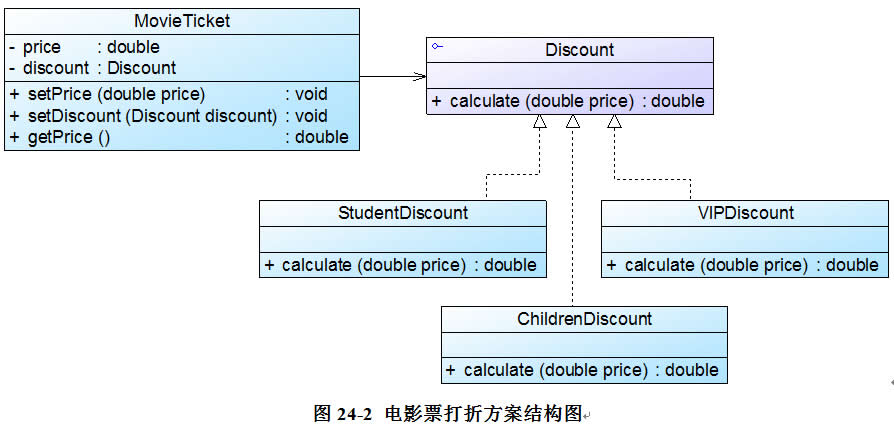

# 使用策略模式对电影院打折方案进行重构

MovieTicket充当环境类角色，Discount充当抽象策略角色，StudentDiscount、 ChildrenDiscount 和VIPDiscount充当具体策略角色。

如果需要增加新的打折方式，原有代码均无须修改，只要增加一个新的折扣类作为抽象折扣类的子类，实现在抽象折扣类中声明的打折方法，然后修改配置文件，将原有具体折扣类类名改为新增折扣类类名即可，完全符合“开闭原则”。

就是工厂模式在算法领域的运行！-->`接口+具体类+工厂(环境类)引用具体类+客户端注入具体实现+读取配置文件解耦`

