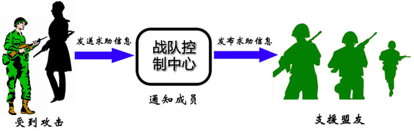

# 观察者模式——对象间的联动
## 生活中的例子——红绿灯：

观察者模式是设计模式中的“`超级模式`”，其应用`随处可见`。

“红灯停，绿灯行”，在日常生活中，交通信号灯装点着我们的城市，指挥着日益拥挤的城市交通。当红灯亮起，来往的汽车将停止；而绿灯亮起，汽车可以继续前行。
在这个过程中，`交通信号灯`是汽车（更准确地说应该是汽车驾驶员）的`观察目标`，而`汽车是观察者`。随着交通信号灯的变化，汽车的行为也将随之而变化，`一盏交通信号灯可以指挥多辆汽车`。

---
在软件系统中，`有些对象之间也存在类似交通信号灯和汽车之间的关系`，一个对象的状态或行为的变化将`导致其他对象`的状态或行为也发生改变，它们之间将产生`联动`，
正所谓“触一而牵百发”。为了更好地描述对象之间存在的这种`一对多（包括一对一）的联动`，观察者模式应运而生，它定义了对象之间一种一对多的依赖关系，让一个对象
的改变能够影响其他对象。本章我们将学习用于实现对象间联动的观察者模式。

---
## 多人联机对战游戏的设计

Sunny软件公司欲开发一款`多人联机对战游戏`（类似魔兽世界、星际争霸等游戏），在该游戏中，多个玩家可以加入同一战队组成联盟，当战队中某一成员受到敌人攻击
时将给`所有其他盟友发送通知`，盟友收到通知后将作出响应。 Sunny软件公司开发人员需要提供一个设计方案来实现战队成员之间的联动。

---
Sunny软件公司开发人员通过对系统功能需求进行分析，发现在该系统中战队成员之间的联动过程可以简单描述如下：

      联盟成员受到攻击-->发送通知给盟友-->盟友作出响应。

如果按照上述思路来设计系统，由于联盟成员在受到攻击时需要通知他的每一个盟友，因此每个联盟成员都需要持有其他所有盟友的信息，这将导致系统开销较大，因此
Sunny公司开发人员决定引入一个新的角色——`“战队控制中心”`——来负责`维护和管理`每个战队所有成员的信息。当一个联盟成员受到攻击时，将向相应的战队控制中心发送
求助信息，战队控制中心再逐一通知每个盟友，盟友再作出响应.

受攻击的联盟成员将与`战队控制中心产生联动`，战队控制中心还将与其他盟友`产生联动`【这不和中介者模式很像吗？】。

如何实现对象之间的联动？如何让一个对象的状态或行为改变时，依赖于它的对象能够得到通知并进行相应的处理？

别着急，本章所介绍的观察者模式将为对象之间的联动提供一个优秀的解决方案，下面就让我们正式进入观察者模式的学习。
