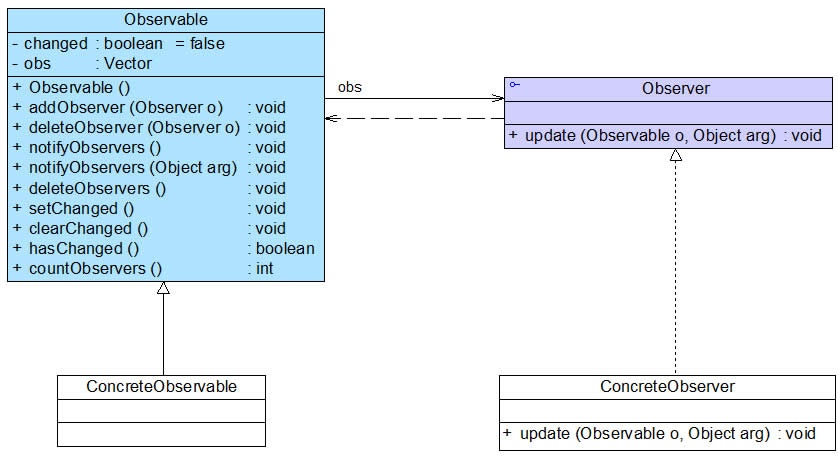
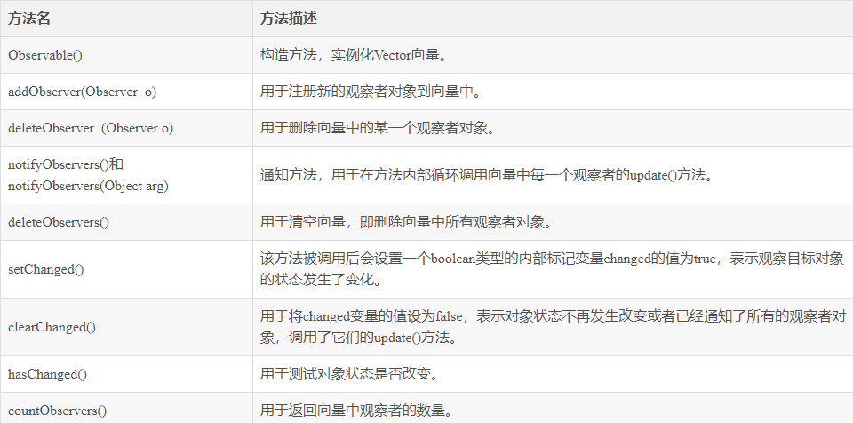

# JDK中的观察者模式

观察者模式在Java语言中的地位非常重要。在JDK的java.util包中，提供了Observable类以及Observer接口，它们构成了JDK对观察者模式的支持。如图22-5所示：

(1)  Observer接口

      在java.util.Observer接口中只声明一个方法，它充当抽象观察者，其方法声明代码如下所示：

      void  update(Observable o, Object arg);

      当观察目标的状态发生变化时，该方法将会被调用，在Observer的子类中将实现update()方法，即具体观察者可以根据需要具有不同的更新行为。当调用观察目标类Observable的notifyObservers()方法时，将执行观察者类中的update()方法。

(2)  Observable类

      java.util.Observable类充当观察目标类，在Observable中定义了一个向量Vector来存储观察者对象，它所包含的方法及说明见表22-1：

我们可以直接使用Observer接口和Observable类来作为`观察者模式的抽象层`，再自定义`具体观察者类和具体观察目标类`，通过使用JDK中的Observer接口和Observable类，可以更加方便地在Java语言中应用观察者模式。

