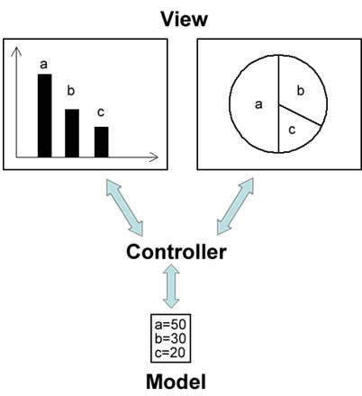

# e观察者模式与MVC

在当前流行的MVC(Model-View-Controller)·`架构`中也应用了观察者模式，MVC是一种`架构模式`，它包含三个角色：`模型(Model)`，`视图(View)`和`控制器(Controller)`。
其中`模型可对应于观察者模式中的观察目标`，而`视图对应于观察者`，`控制器可充当两者之间的中介者`。当模型层的数据发生改变时，视图层将自动改变其显示内容。

`模型层`提供的数据是`视图层所观察的对象`，在视图层中包含两个用于显示数据的图表对象，一个是`柱状图，一个是饼状图`，相同的数据拥有不同的图表显示方式，如果模型层的数据发生改变，
两个图表对象将随之发生变化，这意味着图表对象依赖模型层提供的数据对象，因此数据对象的任何状态改变都应立即通知它们。同时，这两个图表之间相互独立，不存在任何联系，
而且图表对象的个数没有任何限制，用户可以根据需要再增加新的图表对象，如折线图。在增加新的图表对象时，无须修改原有类库，满足“`开闭原则`”。

