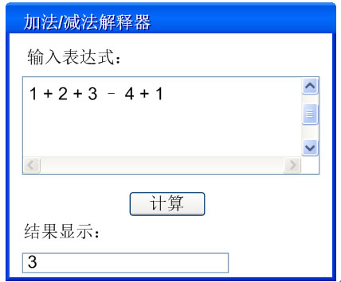
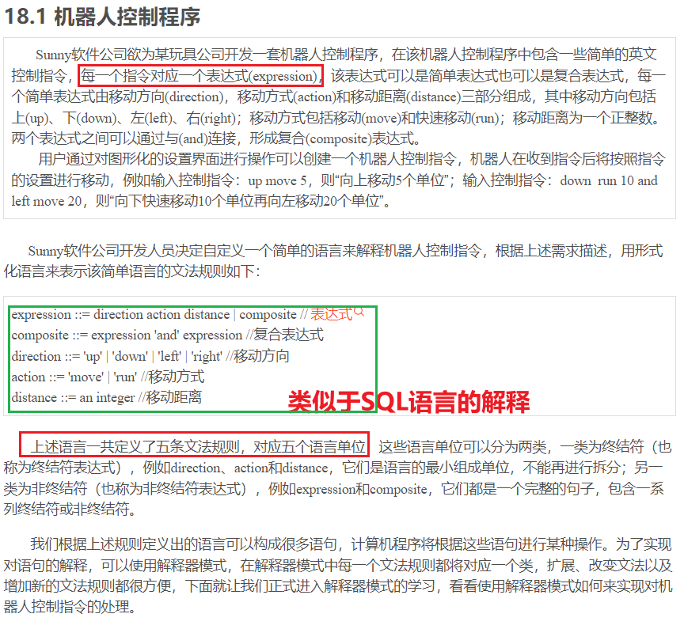
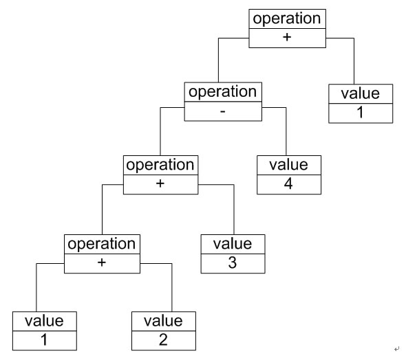

解释器模式——自定义语言的实现

# 需求引出

虽然目前计算机编程语言有好几百种，但有时候我们还是希望能用一些简单的语言来实现一些特定的操作，我们只要向计算机输入一个句子或文件，它就能够按照预先定义的
文法规则来对句子或文件进行解释，从而实现相应的功能。例如提供一个简单的加法/减法解释器，只要输入一个加法/减法表达式，它就能够计算出表达式结果，如图所示，
当输入字符串表达式为“1 + 2 + 3 – 4 + 1”时，将输出计算结果为3。

我们知道，像C++、Java和C#等语言无法直接解释类似“1+ 2 + 3 – 4 + 1”这样的字符串（如果直接作为数值表达式时可以解释），`我们必须自己定义一套文法规则
来实现对这些语句的解释，即设计一个自定义语言`。在实际开发中，这些简单的自定义语言可以基于现有的编程语言来设计，如果所基于的编程语言是面向对象语言，
此时可以使用解释器模式来实现自定义语言。

# 真实项目——机器人指令
## 项目背景

我们根据上述规则定义出的语言可以构成很多语句，计算机程序将根据这些语句进行某种操作。`为了实现对语句的解释，可以使用解释器模式`，`在解释器模式中每
一个文法规则都将对应一个类，扩展、改变文法以及增加新的文法规则都很方便`，下面就让我们正式进入解释器模式的学习，看看使用解释器模式如何来实现对机器人控制指令的处理。

## 文法规则与抽象语法树
`解释器模式描述了如何为简单的语言定义一个文法，如何在该语言中表示一个句子，以及如何解释这些句子`。在正式分析解释器模式结构之前，我们先来学习`如何表示一个语言的文法规则以及如何构造一棵抽象语法树`。
在前面所提到的加法/减法解释器中，每一个输入表达式，例如“1 + 2 + 3 – 4 + 1”，·`都包含了三个语言单位`，可以使用如下文法规则来定义：

---
expression ::= value | operation //表示表达式的组成方式。由值与操作组成

operation ::= expression '+' expression | expression '-'  expression

value ::= an integer //一个整数值

---

该文法规则包含三条语句，第一条表示表达式的组成方式，其中value和operation是后面两个语言单位的定义，每一条语句所定义的字符串如operation和value
称为语言构造成分或语言单位，符号“::=”表示“定义为”的意思，其左边的语言单位通过右边来进行说明和定义，语言单位对应终结符表达式和非终结符表达式。
如本规则中的·`operation是非终结符表达式，它的组成元素仍然可以是表达式，可以进一步分解·`，而`value是终结符表达式，它的组成元素是最基本的语言单位，不能再进行分解`。

在文法规则定义中可以使用一些符号来表示不同的含义，如使用“|”表示或，使用“{”和“}”表示组合，使用“*”表示出现0次或多次等，其中使用频率最高的符号是表示“或”关系的“|”，
如文法规则“boolValue ::= 0 | 1”表示终结符表达式boolValue的取值可以为0或者1。

除了使用文法规则来定义一个语言，在解释器模式中还可以通过一种称之为·`抽象语法树`(Abstract Syntax Tree, AST)的图形方式来直观地表示语言的构成，
每一棵抽象语法树对应一个语言实例，如加法/减法表达式语言中的语句“1+ 2 + 3 – 4 + 1”，可以通过如图18-2所示抽象语法树来表示：

在图中终结符表达式类的实例作为树的叶子节点，而非终结符表达式类的实例作为非叶子节点，它们可以将终结符表达式类的实例以及包含终结符和非终结符实例的子表达式作为其子节点。
抽象语法树描述了如何构成一个复杂的句子，通过对抽象语法树的分析，可以识别出语言中的终结符类和非终结符类。

