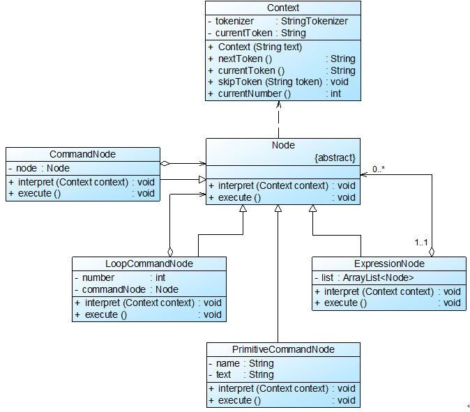

# 再谈环境类Context的作用

在解释器模式中，环境类Context`用于存储解释器之外的一些全局信息`，它通常`作为参数被传递到所有表达式`的解释方法interpret()中，可以在Context对象中存储和访问表达式解释器的状态，
`向表达式解释器提供一些全局的、公共的数据，此外还可以在Context中增加一些所有表达式解释器都共有的功能，减轻解释器的职责`。

在上面的机器人控制程序实例中，我们省略了环境类角色，下面再通过一个简单实例来说明环境类的用途：

Sunny软件公司开发了一套简单的基于字符界面的格式化指令，可以根据输入的指令在字符界面中输出一些格式化内容，例如输入
“`LOOP 2 PRINT杨过 SPACE SPACE PRINT 小龙女 BREAK END PRINT郭靖 SPACE SPACE PRINT 黄蓉`”，将输出如下结果：

杨过     小龙女

杨过     小龙女

郭靖     黄蓉

其中关键词LOOP表示“循环”，后面的数字表示循环次数；PRINT表示“打印”，后面的字符串表示打印的内容；SPACE表示“空格”；`BREAK表示“换行”`；END表示“循环结束”。
每一个关键词对应一条命令，`计算机程序将根据关键词执行相应的处理操作`。

现使用解释器模式设计并实现该格式化指令的解释，对指令进行分析并调用相应的操作执行指令中每一条命令。

Sunny软件公司开发人员通过分析，根据该格式化指令中句子的组成，定义了如下文法规则：

---
expression ::= command* //`表达式，一个表达式包含多条命令`

command ::= loop | primitive //语句命令

loop ::= 'loopnumber' expression  'end' //循环命令，其中number为自然数

primitive ::= 'printstring'  | 'space' | 'break' //`基本命令，其中string为字符串`

---

项目图：

Context充当环境角色，Node充当抽象表达式角色，ExpressionNode、CommandNode和LoopCommandNode充当非终结符表达式角色，PrimitiveCommandNode充当终结符表达式角色。完整代码如下所示：

