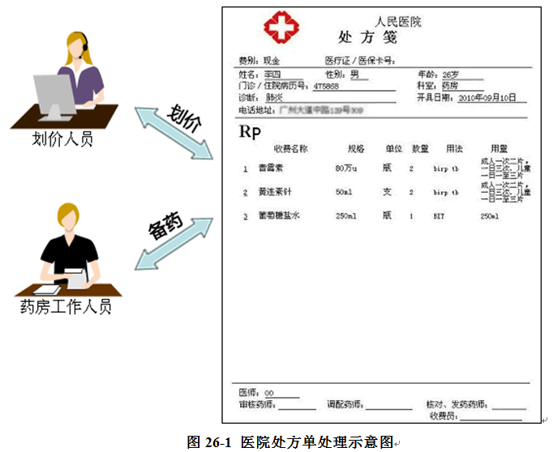
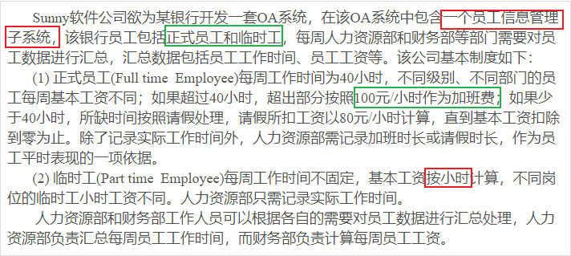

操作复杂对象的结构——访问者模式——核心就是一个回调函数！

# 生活例子——医院药单处理结果
在医生开具处方单（药单）后，很多医院都存在如下处理流程：划价人员拿到处方单之后根据药品名称和数量计算总价，药房工作人员根据药品名称和数量准备药品


我们可以将处方单看成一个`药品信息的集合`，里面包含了一种或多种不同类型的药品信息，不同类型的工作人员（如划价人员和药房工作人员）
在操作同一个药品信息集合时`将提供不同的处理方式`，而且可能还会`增加新类型`的工作人员来操作处方单。

## 引出访问者模式
在软件开发中，有时候我们也需要处理像处方单这样的`集合对象结构`，在该对象结构中存储了`多个不同类型的对象信息`，而且对同一对象结构中的元素的`操作方式并不唯一`，
可能需要提供多种不同的处理方式，还有可能增加新的处理方式。在设计模式中，有一种模式可以满足上述要求，`其模式动机就是以不同的方式操作复杂对象结构`，该模式就是访问者模式。
## 真实项目——银行办公系统



## 初始解决方案
```java
import java.util.*;
 
class EmployeeList
{
	private ArrayList<Employee> list = new ArrayList<Employee>(); //员工集合
 
    //增加员工
	public void addEmployee(Employee employee) 
	{
		list.add(employee);
	}
    
    //处理员工数据
	public void handle(String departmentName)
	{
		if(departmentName.equalsIgnoreCase("财务部")) //财务部处理员工数据
		{
			for(Object obj : list)
			{
				if(obj.getClass().getName().equalsIgnoreCase("FulltimeEmployee"))
				{
					System.out.println("财务部处理全职员工数据！");			
				}
				else 
				{
					System.out.println("财务部处理兼职员工数据！");
				}
			}
		}
		else if(departmentName.equalsIgnoreCase("人力资源部")) //人力资源部处理员工数据
		{
			for(Object obj : list)
			{
				if(obj.getClass().getName().equalsIgnoreCase("FulltimeEmployee"))
				{
					System.out.println("人力资源部处理全职员工数据！");					
				}
				else 
				{
					System.out.println("人力资源部处理兼职员工数据！");
				}
			}			
		}
	}
}
```

----
## 缺点

  (1) EmployeeList类非常庞大，它将各个部门处理各类员工数据的代码集中在一个类中，在具体实现时，代码将相当冗长，EmployeeList类承担了过多的职责，既不方便代码的复用，也不利于系统的扩展，违背了`“单一职责原则”`。

  (2)在代码中包含`大量的“if…else…”`条件判断语句，既需要对不同部门进行判断，又需要对不同类型的员工进行判断，还将出现嵌套的条件判断语句，导致测试和维护难度增大。

  (3)如果要增加一个新的部门来操作员工集合，`不得不修改`EmployeeList类的源代码，在handle()方法中增加一个新的条件判断语句和一些业务处理代码来实现新部门的访问操作。这违背了`“开闭原则”`，系统的灵活性和可扩展性有待提高。

  (4)如果要增加一种新类型的员工，同样需要修改EmployeeList类的源代码，在不同部门的处理代码中增加对新类型员工的处理逻辑，这也违背了“开闭原则”。


## 解决方案
访问者模式就是一个值得考虑的解决方案，它可以在一定程度上解决上述问题（解决大部分问题）。访问者模式可以为`为不同类型的元素提供多种访问操作方式`，
而且可以在`不修改原有系统的情况下增加新的操作方式`。


