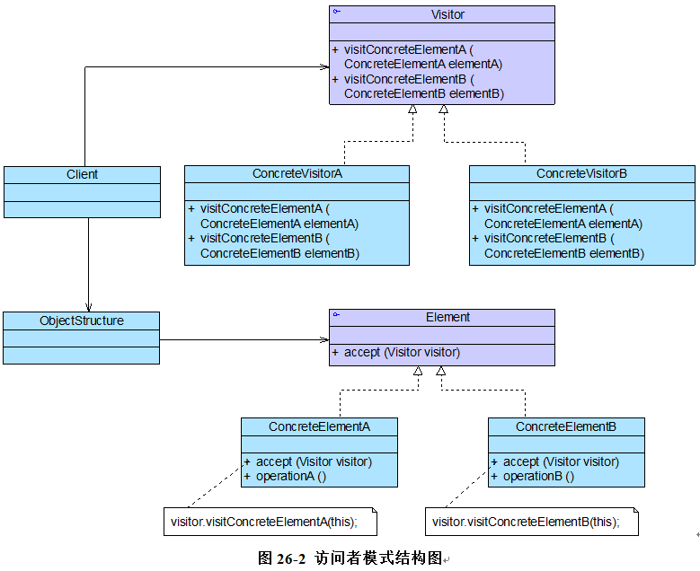

操作复杂对象结构——访问者模式

# 概述

访问者模式是一种较为复杂的行为型设计模式，它包含`访问者`和`被访问元素`两个主要组成部分，这些被访问的元素通常具有不同的类型，且不同的访问者可以对它们进行不同的访问操作。
例如处方单中的`各种药品信息就是被访问的元素`，而`划价人员和药房工作人员就是访问者`
。访问者模式使得用户可以在不修改现有系统的情况下扩展系统的功能，为这些不同类型的元素增加新的操作。

## 定义

访问者模式(Visitor Pattern):
提供一个作用于某对象结构中的`各元素的操作表示`，它使我们可以在`不改变各元素的类的前提下定义作用于这些元素的新操作`
。访问者模式是一种对象行为型模式。

## 结构图



## 角色

●Vistor（抽象访问者）：抽象访问者为对象结构中每一个具体元素类ConcreteElement`声明一个访问操作`
，从这个操作的名称或参数类型可以清楚知道需要访问的具体元素的类型，具体访问者需要实现这些操作方法，定义对这些元素的访问操作。

●ConcreteVisitor（具体访问者）：具体访问者`实现`了每个由抽象访问者声明的操作，每一个操作用于访问对象结构中一种类型的元素。

●Element（抽象元素）：抽象元素一般是抽象类或者接口，它定义一个accept()方法，该方法通常以一个抽象访问者作为参数。【稍后将介绍为什么要这样设计。】

●ConcreteElement（具体元素）：具体元素实现了accept()方法，在accept()方法中调用访问者的访问方法以便完成对一个元素的操作。

● ObjectStructure（对象结构）：对象结构是`一个元素的集合`
，它用于存放元素对象，并且提供了遍历其内部元素的方法。它可以`结合组合模式来实现`，也可以是一个`简单的集合对象`
，如一个List对象或一个Set对象。

## 典型代码

### 抽象访问者

在访问者模式中，抽象访问者定义了访问元素对象的方法，通常为每一种类型的元素对象都提供一个访问方法，而具体访问者可以实现这些访问方法。这些访问方法的命名一般有两种方式：
一种是直接在方法名中标明待访问元素对象的具体类型，如visitElementA(ElementA elementA)，还有一种是统一`取名为visit()`
，通过参数类型的不同来定义一系列重载的visit()方法。
当然，如果所有的访问者对某一类型的元素的访问操作都相同，则可以将操作代码移到抽象访问者类中，其典型代码如下所示：

```java
abstract class Visitor {
    public abstract void visit(ConcreteElementA elementA);

    public abstract void visit(ConcreteElementB elementB);

    public void visit(ConcreteElementC elementC) {
        //元素ConcreteElementC操作代码
    }
}
```

-----
### 具体访问者
重载visit()方法的方式来定义多个方法用于操作不同类型的元素对象

```java
class ConcreteVisitor extends Visitor
{
	public void visit(ConcreteElementA elementA)
	{
		//元素ConcreteElementA操作代码
	}
	public void visit(ConcreteElementB elementB)
	{
		//元素ConcreteElementB操作代码
	}
}
```

### 抽象元素类
对于元素类而言，在其中一般都定义了一个accept()方法，用于接受访问者的访问，典型的抽象元素类代码如下所示： 

```java
interface Element
{
	public void accept(Visitor visitor);
}
```

### 具体元素类
针对抽象访问者进行编程，而不是具体访问者，在程序运行时再确定具体访问者的类型，并调用具体访问者对象的visit()方法实现对元素对象的操作。

```java
class ConcreteElementA implements Element {
    public void accept(Visitor visitor) {
        visitor.visit(this);//注意这里将this传入！！
    }

    public void operationA() {
        //业务方法
    }
}
```

## 双重分派

在具体元素类ConcreteElementA的accept()方法中，通过调用Visitor类的visit()方法实现对元素的访问，并以当前对象作为visit()方法的参数。其具体执行过程如下：

      (1) 调用具体元素类的accept(Visitor visitor)方法，并将Visitor子类对象作为其参数；

      (2) 在具体元素类accept(Visitor visitor)方法内部调用传入的Visitor对象的visit()方法，如visit(ConcreteElementA elementA)，将当前具体元素类对象(this)作为参数，如visitor.visit(this)；

      (3) 执行Visitor对象的visit()方法，在其中还可以调用具体元素对象的业务方法。

这种调用机制也称为`“双重分派”`，正因为使用了~~双重分派机制~~，使得增加新的访问者无须修改现有类库代码，只需将新的访问者对象作为参数传入具体元素对象的accept()方法，程序运行时将`回调在新增Visitor类中定义的visit()方法`，从而增加新的元素访问方式。


----
### 对象结构类

在访问者模式中，对象结构是一个集合，它用于`存储元素对象并接受访问者的访问`，其典型代码如下所示：
```java
class ObjectStructure {
    private ArrayList<Element> list = new ArrayList<Element>(); //定义一个集合用于存储元素对象

    public void accept(Visitor visitor) {
        Iterator i = list.iterator();

        while (i.hasNext()) {
            ((Element) i.next()).accept(visitor); //遍历访问集合中的每一个元素
        }
    }

    public void addElement(Element element) {
        list.add(element);
    }

    public void removeElement(Element element) {
        list.remove(element);
    }
}
```


