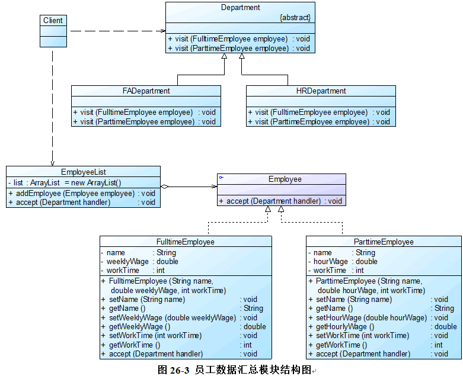

# 银行OA系统完整解决方案

FADepartment表示`财务部`，HRDepartment表示`人力资源部`，它们充当具体`访问者角色`，其抽象父类Department充当抽象访问者角色；EmployeeList充当`对象结构`，
用于存储员工列表；FulltimeEmployee表示`正式员工`，ParttimeEmployee表示`临时工`，它们充当具体元素角色，其父接口Employee充当抽象元素角色。

完整代码如下所示：

