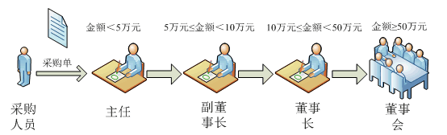

# 责任链模式
---
## 生活例子1——斗地主
 一对二”，“过”，“过”……这声音熟悉吗？你会想到什么？对！纸牌。在类似“斗地主”这样的纸牌游戏中，某人出牌给他的下家，下家看看手中的牌，如果要不起上家的牌
 则将出牌请求再转发给他的下家，其下家再进行判断。一个循环下来，如果其他人都要不起该牌，则最初的出牌者可以打出新的牌。**在这个过程中，牌作为一个请求沿着
 一条链在传递，每一位纸牌的玩家都可以处理该请求**。在设计模式中，**我们也有一种专门用于处理这种请求链式传递的模式，它就是本章将要介绍的职责链模式**。
 
## 生活例子2——企业的分级采购审批
Sunny软件公司承接了某企业SCM(Supply Chain Management，供应链管理)系统的开发任务，其中包含一个采购审批子系统。该企业的采购审批是分级进行的，
即根据采购金额的不同由不同层次的主管人员来审批，主任可以审批5万元以下（不包括5万元）的采购单，副董事长可以审批5万元至10万元（不包括10万元）的采购单，
董事长可以审批10万元至50万元（不包括50万元）的采购单，50万元及以上的采购单就需要开董事会讨论决定。如图16-1所示：


### 初始解决方案
```java
//采购单处理类
class PurchaseRequestHandler {
 //递交采购单给主任
 public void sendRequestToDirector(PurchaseRequest request) {
  if (request.getAmount() < 50000) {
   //主任可审批该采购单
   this.handleByDirector(request);
  } else if (request.getAmount() < 100000) {
   //副董事长可审批该采购单
   this.handleByVicePresident(request);
  } else if (request.getAmount() < 500000) {
   //董事长可审批该采购单
   this.handleByPresident(request);
  } else {
   //董事会可审批该采购单
   this.handleByCongress(request);
  }
 }

 //主任审批采购单
 public void handleByDirector(PurchaseRequest request) {
  //代码省略
 }

 //副董事长审批采购单
 public void handleByVicePresident(PurchaseRequest request) {
  //代码省略
 }

 //董事长审批采购单
 public void handleByPresident(PurchaseRequest request) {
  //代码省略
 }

 //董事会审批采购单
 public void handleByCongress(PurchaseRequest request) {
  //代码省略
 }
}
```
由如下问题：
1. PurchaseRequestHandler类汇总混杂了各级领导的处理，职责太多，不符合`单一职责原理`
2. 如果需要增加或者移除某一个级别，就需要大量的源码修改，不符合`开闭原则`
3. 审批流程缺乏灵活性，如果是改为“主任-->董事长-->董事会”，在此方案中只能通过修改源代码来实现，客户端无法定制审批流程。

有职责链模式，通过使用职责链模式我们可以最大程度地解决这些问题
---

# 责任链 模式概述
很多情况下，在一个软件系统中可以处理某个请求的对象不止一个，例如SCM系统中的采购单审批，主任、副董事长、董事长和董事会都可以处理采购单，**他们可以
构成一条处理采购单的链式结构，采购单沿着这条链进行传递，这条链就称为职责链**。**职责链可以是一条直线、一个环或者一个树形结构，最常见的职责链是直线型**，
即沿着一条单向的链来传递请求。**链上的每一个对象都是请求处理者**，职责链模式可以将请求的处理者组织成一条链，**并让请求沿着链传递**，由链上的处理者对请求
进行相应的处理，客户端无须关心请求的处理细节以及请求的传递，只需将请求发送到链上即可，**实现请求发送者和请求处理者解耦**。

## 定义
职责链模式：
**避免请求发送者与接收者耦合在一起**，**让多个对象都有可能接收请求，将这些对象连接成一条链，并且沿着这条链传递请求，直到有对象处理它为止**。
职责链模式是一种对象行为型模式。

职责链模式结构的核心在于引入了一个抽象处理者。


## 包含角色
      ● Handler（抽象处理者）：它定义了一个处理请求的接口，一般设计为抽象类，由于不同的具体处理者处理请求的方式不同，因此在其中定义了抽象请求处理方法。
        因为每一个处理者的下家还是一个处理者，因此在抽象处理者中定义了一个抽象处理者类型的对象（如结构图中的successor），作为其对下家的引用。通过该引用，
        处理者可以连成一条链。

      ● ConcreteHandler（具体处理者）：它是抽象处理者的子类，可以处理用户请求，在具体处理者类中实现了抽象处理者中定义的抽象请求处理方法，
        在处理请求之前需要进行判断，看是否有相应的处理权限，如果可以处理请求就处理它，否则将请求转发给后继者；在具体处理者中可以访问链中下一个对象，以便请求的转发。

在职责链模式里，**很多对象由每一个对象对其下家的引用而连接起来形成一条链**。**请求在这个链上传递，直到链上的某一个对象决定处理此请求**。
发**出这个请求的客户端并不知道链上的哪一个对象最终处理这个请求，这使得系统可以在不影响客户端的情况下动态地重新组织链和分配责任**。

## 典型代码

`抽象处理者`
抽象处理者类定义了对下家的引用对象，以便将请求转发给下家，该对象的访问符可设为protected，在其子类中可以使用。
在抽象处理者类中声明了抽象的请求处理方法，具体实现交由子类完成。
```java
abstract class Handler {
	//维持对下家的引用
protected Handler successor;
	
	public void setSuccessor(Handler successor) {
		this.successor=successor;
	}
	
	public abstract void handleRequest(String request);
}
```

---
`具体处理者`
两大作用：
第一是处理请求，不同的具体处理者以不同的形式实现抽象请求处理方法handleRequest()；
第二是转发请求，如果该请求超出了当前处理者类的权限，可以将该请求转发给下家。

```java
class ConcreteHandler extends Handler {
	public void handleRequest(String request) {
		if (请求满足条件) {
			//处理请求
		}
		else {
			this.successor.handleRequest(request);  //转发请求
		}
	}
}
```

## 职责链的创建
需要注意的是，**职责链模式并不创建职责链，职责链的创建工作必须由系统的其他部分来完成，一般是在使用该职责链的客户端中创建职责链**。
职责链模式降低了请求的发送端和接收端之间的耦合，使多个对象都有机会处理这个请求。


