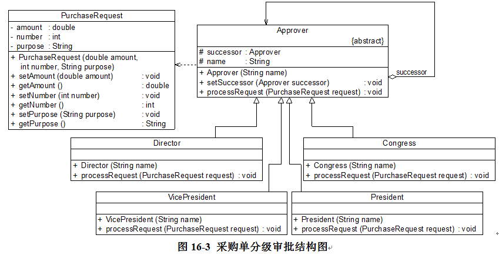

# 完整解决方案
Sunny公司开发人员使用职责链模式来实现采购单的分级审批

抽象类Approver充当抽象处理者（抽象传递者），Director、VicePresident、President和Congress充当具体处理者（具体传递者），PurchaseRequest充当请求类。
具体见项目

# 纯与不纯的责任链模式
责任链模式可以分为纯与不纯的责任链模式两种：

1. 纯的责任链模式
一个纯的责任链模式要求一个具体处理者对象只能在两个行为中选择一个： 

1.1. 要么承担全部责任，要么将责任推给下家，不允许出现某一个具体处理者对象在承担了一部分或全部责任后，又将责任向下传的情况，

1.2. 要求某一个请求必须被某一个处理者对象所接收。 不能出现某个请求未被任何一个处理者对象处理的情况。在前面的采购单审批实例中应用的是纯的职责链模式。

---
2. 不纯的责任链模式
   在一个不纯的职责链模式中允许某个请求被一个具体处理者部分处理后再向下传递，或者一个具体处理者处理完某请求后其后继处理者可以继续处理该请求，而且一个请求可以最终不被任何处理者对象所接收。

### 不纯的责任链的典例
Java AWT 1.0中的事件处理模型应用的是不纯的职责链模式，其基本原理如下：由于窗口组件（如按钮、文本框等）一般都位于容器组件中，因此当事件发生在某一个组件上时，
先通过组件对象的handleEvent()方法将事件传递给相应的事件处理方法，该事件处理方法将处理此事件，然后决定是否将该事件向上一级容器组件传播；
上级容器组件在接到事件之后可以继续处理此事件并决定是否继续向上级容器组件传播，如此反复，直到事件到达顶层容器组件为止；如果一直传到最顶层容器仍没有处理方法，
则该事件不予处理。每一级组件在接收到事件时，都可以处理此事件，而不论此事件是否在上一级已得到处理，还存在事件未被处理的情况。

# 责任链模式的优缺点
## 优点：
       (1) 职责链模式使得一个对象无须知道是其他哪一个对象处理其请求，对象仅需知道该请求会被处理即可，接收者和发送者都没有对方的明确信息，且链中的对象不需要知道链的结构，由客户端负责链的创建，降低了系统的耦合度。

       (2) 请求处理对象仅需维持一个指向其后继者的引用，而不需要维持它对所有的候选处理者的引用，可简化对象的相互连接。

       (3) 在给对象分派职责时，职责链可以给我们更多的灵活性，可以通过在运行时对该链进行**动态的增加或修改来增加或改变处理一个请求的职责**。

       (4) 在系统中增加一个新的具体请求处理者时无须修改原有系统的代码，**只需要在客户端重新建链即可，从这一点来看是符合“开闭原则”的**。

---
## 缺点：
       (1) 由于一个请求没有明确的接收者，那么就不能保证它一定会被处理，该请求可能一直到链的末端都得不到处理；一个请求也可能因职责链没有被正确配置而得不到处理。

       (2) 对于比较长的职责链，请求的处理可能涉及到多个处理对象，系统性能将受到一定影响，而且在进行代码调试时不太方便。

       (3) **如果建链不当，可能会造成循环调用，将导致系统陷入死循环**。

---
## 适用场景：
        (1) 有多个对象可以处理同一个请求，**具体哪个对象处理该请求待运行时刻再确定，客户端只需将请求提交到链上，而无须关心请求的处理对象是谁以及它是如何处理的**。

        (2) 在不明确指定接收者的情况下，向多个对象中的一个提交一个请求。

        (3) **可动态指定一组对象处理请求，客户端可以动态创建职责链来处理请求，还可以改变链中处理者之间的先后次序**。 

>[!TIP]
>
>This is a standard TIP.

