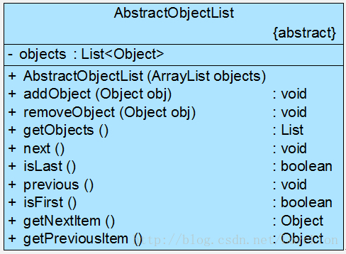
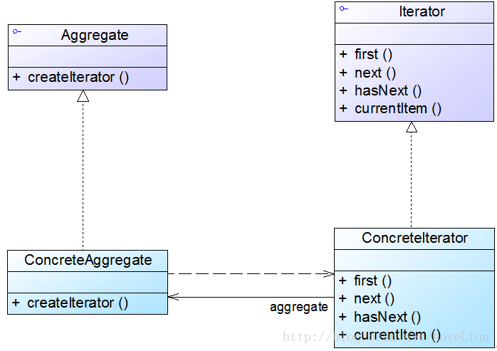
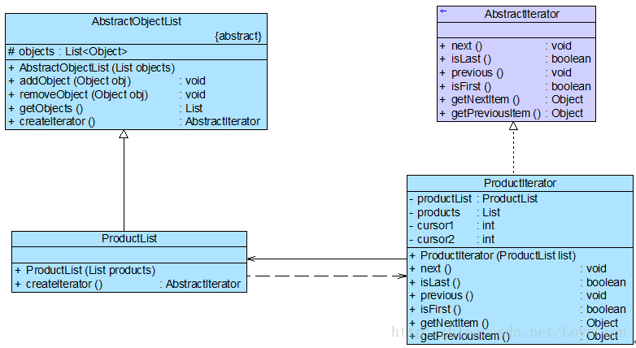

遍历聚合对象中的元素

# 生活的例子——遥控板

电视机遥控器，我们在进行开机、关机、换台、改变音量等操作时都无须直接操作电视机，可以通过遥控器来间接实现。我们可以将`电视机看成一个存储电视频道的集合对象`，
通过遥控器可以对电视机中的电视频道集合进行操作，如返回上一个频道、跳转到下一个频道或者跳转至指定的频道。遥控器为我们操作电视频道带来很大的方便，
用户并不需要知道这些频道到底如何存储在电视机中。

# 引出迭代器模式

在软件开发中，也存在大量类似电视机一样的类，它们可以存储多个成员对象（元素），这些类通常称为`聚合类`(Aggregate Classes)[6大原则之一的合成复用原则]，对应的对象称为·`聚合对象`。
为了更加方便地操作这些聚合对象，同时可以很灵活地为聚合对象增加不同的遍历方法，我们也需要`类似电视机遥控器一样的角色`，可以访问一个`聚合对象中的元素`但
又不需要暴露它的内部结构。本章我们将要学习的迭代器模式将为聚合对象提供一个遥控器，通过引入迭代器，客户端无须了解聚合对象的内部结构即可实现对聚合对象
中成员的遍历，还可以根据需要`很方便地增加新的遍历方式`。


---
## 真实项目
销售管理系统中数据的遍历
Sunny软件公司为某商场开发了一套·`销售管理系统`，在对该系统进行分析和设计时，Sunny软件公司开发人员发现经常需要对系统中的·`商品数据、客户数据`等进行遍历，
为了复用这些遍历代码，Sunny公司开发人员设计了一个抽象的数据集合类AbstractObjectList，而将存储商品和客户等数据的类作为其子类，AbstractObjectList类结构如图2所示：

在图2中，List类型的对象objects用于存储数据，方法说明如表1所示： 表1AbstractObjectList类方法说明:

Sunny软件公司开发人员通过对AbstractObjectList类结构进行分析，发现该设计方案存在如下几个问题：

(1) 在图2所示类图中，addObject()、removeObject()等方法用于管理数据，而next()、isLast()、previous()、isFirst()等方法用于遍历数据。
    这将导致·`聚合类的职责过重`，它既负责存储和管理数据，又负责遍历数据，违反了“单一职责原则”，由于`聚合类非常庞大`，实现代码过长，还将给测试和维护增加难度。

(2) 如果将抽象聚合类声明为一个接口，则在这个`接口中充斥着大量方法`，不利于子类实现，违反了“`接口隔离原则`”。

(3) 如果将所有的遍历操作都交给子类来实现，将导致`子类代码庞大`，而且必须暴露AbstractObjectList的内部存储细节，向子类公开自己的私有属性，否则子类无法实施对数据的遍历，这将破坏AbstractObjectList类的封装性。

如何解决上述问题？`解决方案之一就是将聚合类中负责遍历数据的方法提取出来`，封装到专门的类中，`实现数据存储和数据遍历分离`，`无须暴露聚合类的内部属性即可对其进行操作`，而这正是迭代器模式的意图所在。


## 迭代器概述
在软件开发中，我们经常需要使用聚合对象来存储一系列数据。聚合对象拥有两个职责：一是存储数据；二是遍历数据。从依赖性来看，前者是聚合对象的基本职责；
而后者既是可变化的，又是可分离的。因此，可以将遍历数据的行为从聚合对象中分离出来，封装在一个被称之为“迭代器”的对象中，由迭代器来提供遍历聚合对象内部数据的行为，
这将简化聚合对象的设计，更符合“单一职责原则”的要求。

### 定义
迭代器模式定义如下：
`迭代器模式(Iterator Pattern)：提供一种方法来访问聚合对象，而不用暴露这个对象的内部表示，其别名为游标(Cursor)。迭代器模式是一种对象行为型模式。`

### 结构图



### 包含角色
在迭代器模式结构图中包含如下几个角色：

● `Iterator（抽象迭代器）·`：它定义了访问和遍历元素的接口，声明了用于遍历数据元素的方法，例如：用于获取第一个元素的first()方法，用于访问下一个元素的next()方法，
   用于判断是否还有下一个元素的hasNext()方法，用于获取当前元素的currentItem()方法等，在具体迭代器中将实现这些方法。

● `ConcreteIterator（具体迭代器）`：它实现了抽象迭代器接口，完成对聚合对象的遍历，同时在具体迭代器中通过游标来记录在聚合对象中所处的当前位置，在具体实现时，游标通常是一个表示位置的非负整数。

● `Aggregate（抽象聚合类）`：它用于存储和管理元素对象，声明一个createIterator()方法用于创建一个迭代器对象，充当抽象迭代器工厂角色。

● `ConcreteAggregate（具体聚合类）`：它实现了在抽象聚合类中声明的createIterator()方法，该方法返回一个与该具体聚合类对应的具体迭代器ConcreteIterator实例。

在迭代器模式中，提供了一个外部的迭代器来对聚合对象进行访问和遍历，迭代器定义了一个访问该聚合元素的接口，并且可以跟踪当前遍历的元素，了解哪些元素已经遍历过而哪些没有。迭代器的引入，将使得对一个复杂聚合对象的操作变得简单。

下面我们结合代码来对迭代器模式的结构进行进一步分析。在迭代器模式中应用了工厂方法模式，抽象迭代器对应于抽象产品角色，具体迭代器对应于具体产品角色，抽象聚合类对应于抽象工厂角色，具体聚合类对应于具体工厂角色。

在抽象迭代器中声明了用于遍历聚合对象中所存储元素的方法，典型代码如下所示：


### 典型代码

抽象迭代器
需要注意的是抽象迭代器接口的设计非常重要，一方面需要充分满足各种遍历操作的要求，尽量为各种遍历方法都提供声明，另一方面又不能包含太多方法，接口中方法太多将给子类的实现带来麻烦。
```java
interface Iterator {
	public void first(); //将游标指向第一个元素
	public void next(); //将游标指向下一个元素
	public boolean hasNext(); //判断是否存在下一个元素
	public Object currentItem(); //获取游标指向的当前元素
}
```

具体迭代器
具体迭代器中将实现抽象迭代器声明的遍历数据的方法
```java
class ConcreteIterator implements Iterator {
	private ConcreteAggregate objects; //维持一个对具体聚合对象的引用，以便于访问存储在聚合对象中的数据
	private int cursor; //定义一个游标，用于记录当前访问位置
	public ConcreteIterator(ConcreteAggregate objects) {
		this.objects=objects;
	}
 
	public void first() {   }
		
	public void next() {   }
 
	public boolean hasNext() {   }
	
	public Object currentItem() {   }
}
```

聚合类
```java
interface Aggregate {
	Iterator createIterator();
}
```


具体聚合类
具体聚合类作为抽象聚合类的子类，`一方面负责存储数据，另一方面实现了在抽象聚合类中声明的工厂方法createIterator()，用于返回一个与该具体聚合类对应的具体迭代器对象`
```java
class ConcreteAggregate implements Aggregate {	
    //......	
    public Iterator createIterator() {
	return new ConcreteIterator(this);
    }
	//......
}
```

# 项目完整解决方案
为了简化AbstractObjectList类的结构，并给不同的具体数据集合类提供不同的遍历方式，Sunny软件公司开发人员使用迭代器模式来重构AbstractObjectList类的设计


在图4中，AbstractObjectList充当抽象聚合类，ProductList充当具体聚合类，AbstractIterator充当抽象迭代器，ProductIterator充当具体迭代器。完整代码如右：


