# 图的基本概念
二维坐标中，两点可以连成线，多个点连成的线就构成了图。

当然图也可以就一个节点，甚至没有节点（空图）

## 图的种类
整体上一般分为 有向图 和 无向图。

有向图是指 图中边是有方向的：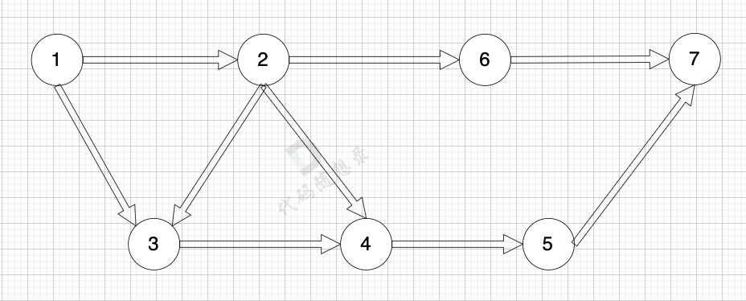
无向图是指 图中边没有方向：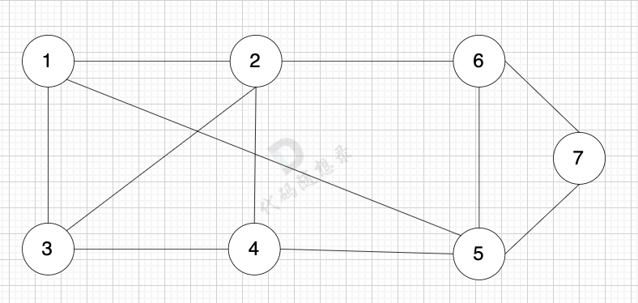
加权有向图，就是图中边是有权值的，例如：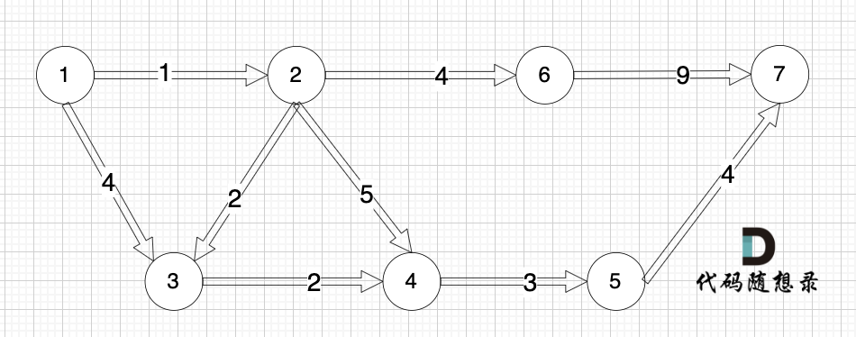
加权无向图也是同理。

## 度
·`无向图中有几条边连接该节点，该节点就有几度`。

例如，该无向图中，节点4的度为5，节点6的度为3: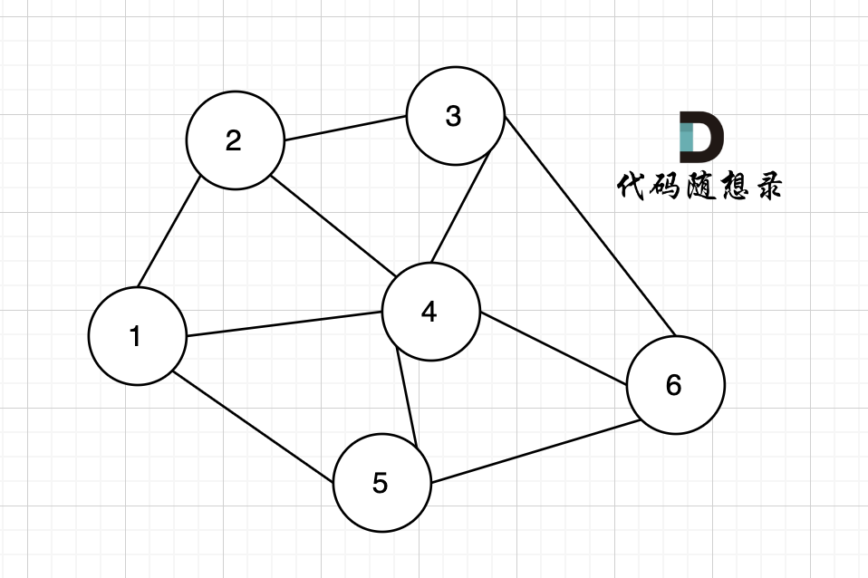

在有向图中，每个节点有出度和入度。

出度：·`从该节点出发的边的个数`。

入度：`指向该节点边的个数`。

例如，该有向图中，节点3的入度为2，出度为1，节点1的入度为0，出度为2。
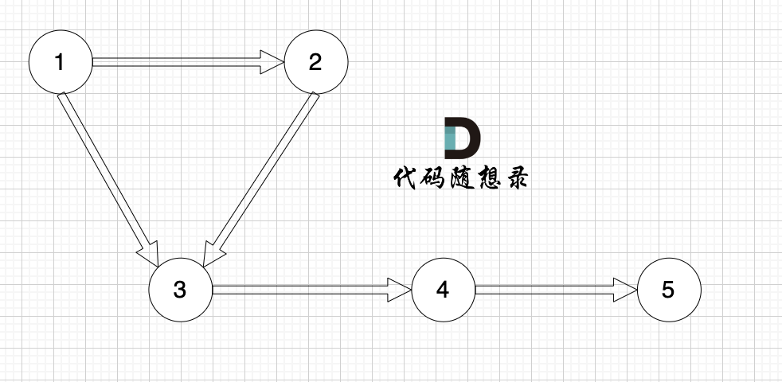

## 连通性
在图中表示节点的连通情况，我们称之为连通性。

### 连通图
在无向图中，任何两个节点都是可以到达的，我们称之为连通图 ，如图：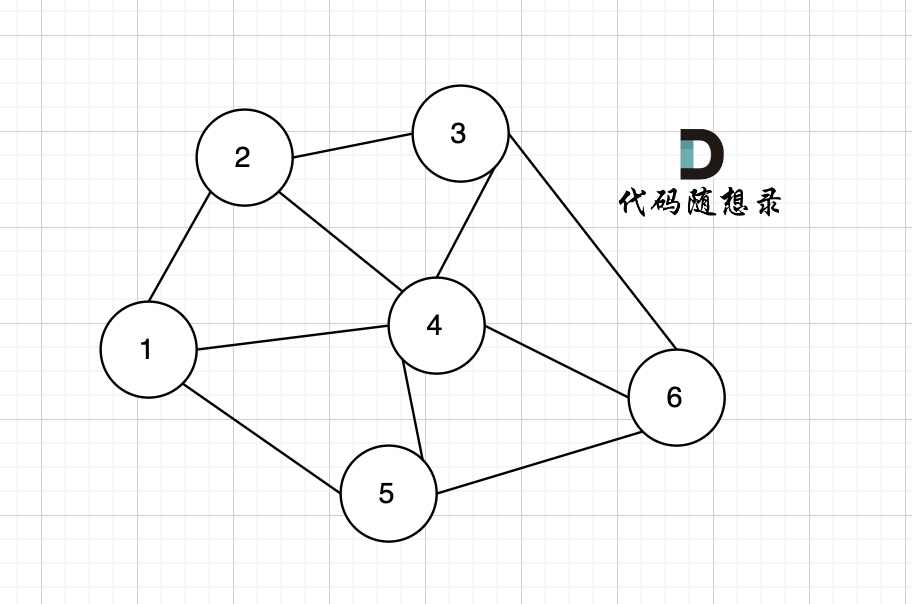

### 非连通图
如果有节点不能到达其他节点，则为非连通图，如图：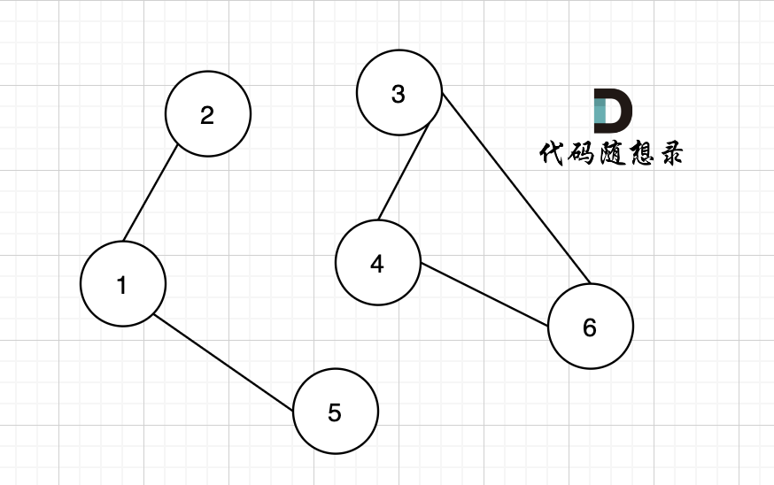

节点1 不能到达节点4。

### 强连通图
在有向图中，`任何两个节点是可以相互到达的`，我们称之为 强连通图。
这和无向图中的连通图有什么区别，不是一样的吗？
我们来看这个有向图：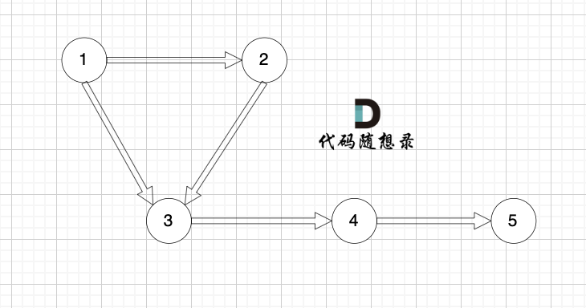
这个图是强连通图吗？
初步一看，好像这节点都连着呢，`但这不是强连通图，节点1 可以到节点5，但节点5 不能到 节点1 `。

`强连通图是在有向图中任何两个节点是可以相互到达`

下面这个有向图才是强连通图：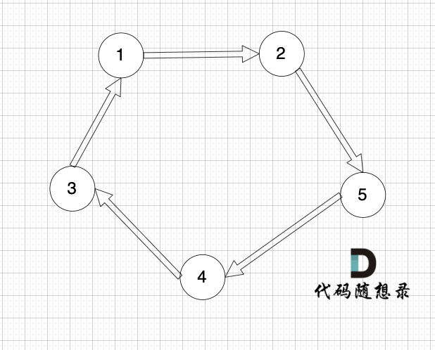

## 连通分量
在·`无向图中的极大连通子图`称之为该图的一个连通分量。

只看概念大家可能不理解，我来画个图：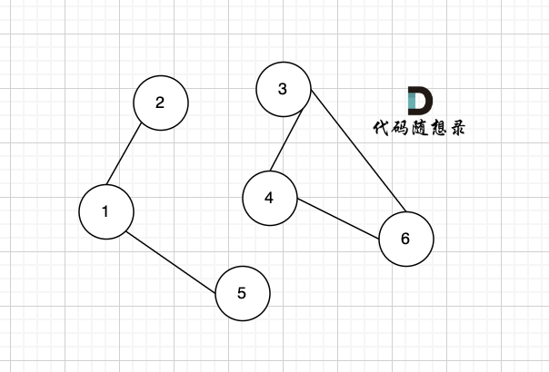
该无向图中 节点1、节点2、节点5 构成的·`子图`就是 该无向图中的一个连通分量，该`子图所有节点都是相互可达到的`。

同理，节点3、节点4、节点6 构成的子图 也是该无向图中的一个连通分量。

那么无向图中 节点3 、节点4 构成的子图 是该无向图的联通分量吗？

不是！

因为`必须是极大联通子图才能是连通分量`，所以 必须是节点3、节点4、节点6 构成的子图才是连通分量。
在图论中，连通分量是一个很重要的概念，例如岛屿问题（后面章节会有专门讲解）其实就是求连通分量。

## 强连通分量
在`有向图中极大强连通子图称之为该图的强连通分量`。

如图：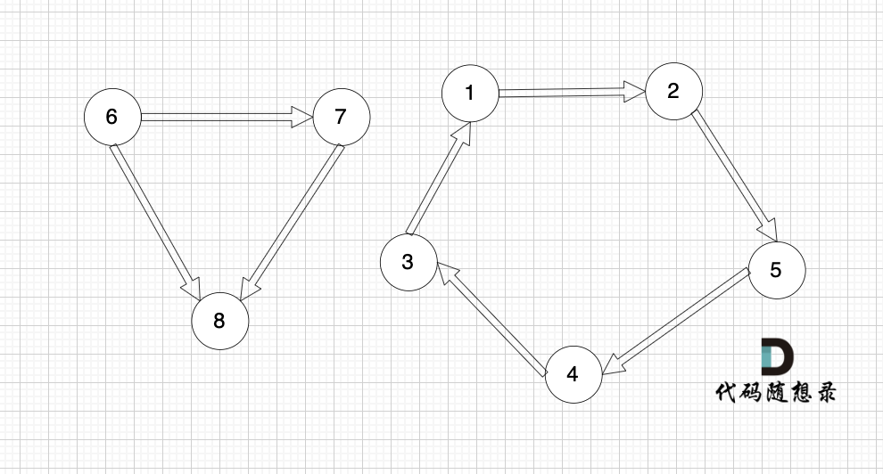

----
# 图的构造
我们如何用代码来表示一个图呢？

一般使用·`邻接表`、`邻接矩阵` 或者用`类`来表示。

主要是 `朴素存储`、`邻接表`和`邻接矩阵`。

---
## 邻接矩阵
`邻接矩阵` 使用 `二维数组`来表示图结构。 邻接矩阵是从`节点`的角度来表示图，有多少节点就申请多大的二维数组。

例如： grid[2][5] = 6，表示 `节点 2 连接 节点5` 为有向图，`节点2 指向 节点5，边的权值为6`。

如果想表示无向图，即：grid[2][5] = 6，grid[5][2] = 6，表示节点2 与 节点5 `相互连通`，`权值为6`。

如图：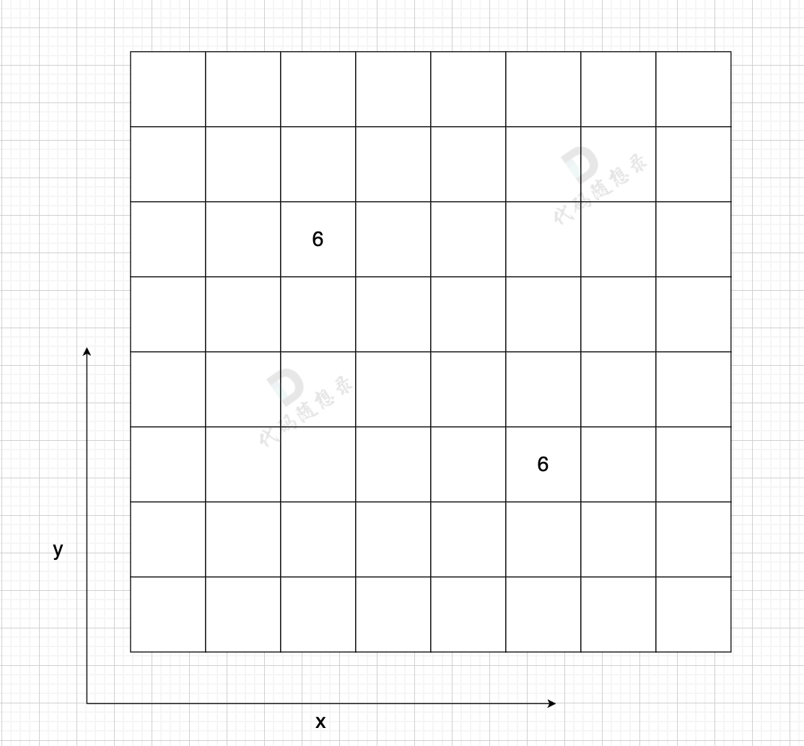
在一个 n （节点数）为8 的图中，就需要申请 8 * 8 这么大的空间。

图中有一条双向边，即：grid[2][5] = 6，grid[5][2] = 6

这种表达方式·`（邻接矩阵） 在 边少，节点多的情况下，会导致申请过大的二维数组，造成空间浪费`。

而且在寻找节点连接情况的时候，需要遍历整个矩阵，即 n * n 的时间复杂度，同样造成时间浪费。

邻接矩阵的优点：
`
表达方式简单，易于理解
检查任意两个顶点间是否存在边的操作非常快
适合稠密图，在边数接近顶点数平方的图中，邻接矩阵是一种空间效率较高的表示方法。
`
缺点：
`
遇到稀疏图，会导致申请过大的二维数组造成空间浪费 且遍历 边 的时候需要遍历整个n * n矩阵，造成时间浪费
`
----
## 邻接表
邻接表
邻接表 使用 `数组 + 链表`的方式来表示。 邻接表是`从边的数量来表示图`，`有多少边 才会申请对应大小的链表`。

邻接表的构造如图：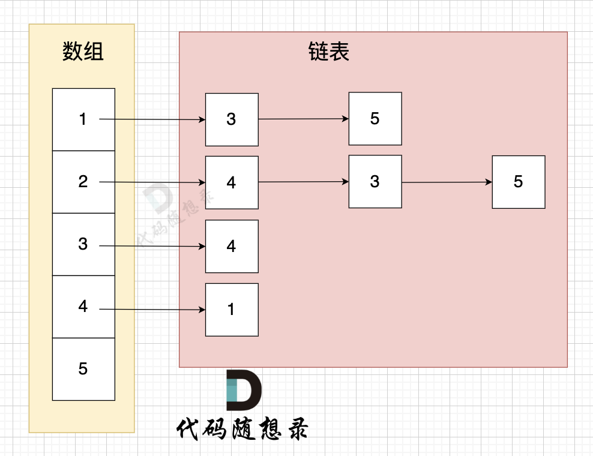
这里表达的图是：
·`
节点1 指向 节点3 和 节点5
节点2 指向 节点4、节点3、节点5
节点3 指向 节点4
节点4指向节点1
`
`有多少边 邻接表才会申请多少个对应的链表节点`。

从图中可以直观看出 使用 数组 + 链表 来表达 边的连接情况 。

邻接表的优点：
`
对于稀疏图的存储，只需要存储边，空间利用率高
遍历节点连接情况相对容易
`
缺点：

检查任意两个节点间是否存在边，效率相对低，需要 O(V)时间，V表示某节点连接其他节点的数量。
实现相对复杂，不易理解
以上大家可能理解比较模糊，没关系，因为大家还没做过图论的题目，对于图的表达没有概念。

# 图的遍历方式
图的遍历方式基本是两大类：

深度优先搜索（dfs）
广度优先搜索（bfs）

