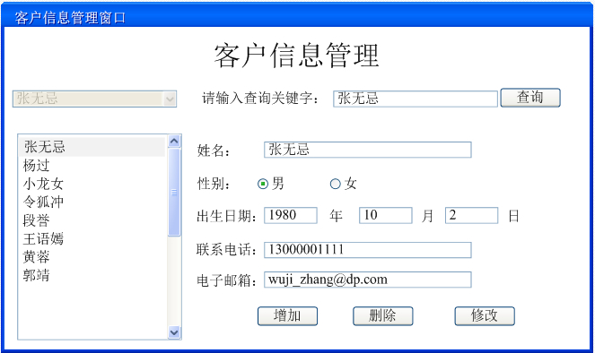
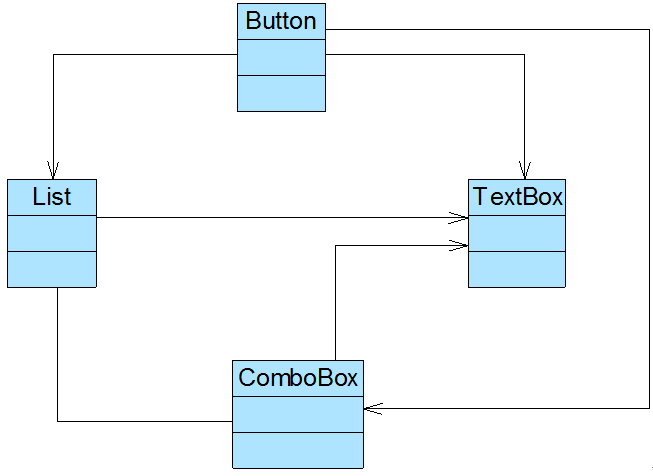

# 中介者模式————协调多个对象之间的交互

## 生活中的例子——QQ群机制
在QQ聊天中，一般有两种聊天方式：第一种是`用户与用户`直接聊天，第二种是通过`QQ群`聊天，一个用户如果要与别的用户聊天或发送文件，通常需要加其他用户为好友，
用户与用户之间存在多对多的联系，这将导致系统中用户之间的关系`非常复杂`，一个用户如果要将相同的信息或文件发送给其他所有用户，必须`一个一个的发送`，于是`QQ群产生`了，
如果使用QQ群，一个用户就可以向多个用户发送相同的信息和文件而无须一一进行发送，只需要`将信息或文件发送到群中或作为群共享`即可，
`群的作用就是将发送者所发送的信息和文件转发给每一个接收者用户`。通过引入群的机制，将极大减少系统中用户之间的两两通信，`用户与用户之间的联系可以通过群来实现`。
.png)
---


## 软件中的例子——SpringMVC中的中央处理器！(所有组件就是和他打交道，然后相互之间完成交互的！)

## 引出中介者模式
在有些软件中，某些类/对象之间的相互调用`关系错综复杂`，类似QQ用户之间的关系，此时，我们特别需要一个类似“QQ群”一样的中间类来·`协调这些类/对象之间`的复杂关系，
以降低系统的耦合度。有一个设计模式正为此而诞生，它就是本章将要介绍的中介者模式。
---

# 实际项目
## 客户信息管理窗口的初始设计
Sunny软件公司欲开发一套CRM系统，其中包含一个客户信息管理模块，所设计的“客户信息管理窗口”界面效果图如图20-2所示：


Sunny公司开发人员通过分析发现，在图20-2中，界面组件之间存在较为复杂的交互关系：如果删除一个客户，要在客户列表(List)中删掉对应的项，客户选择组合框(ComboBox)
中客户名称也将减少一个；如果增加一个客户信息，客户列表中需增加一个客户，且组合框中也将增加一项。 如果实现界面组件之间的交互是Sunny公司开发人员必须面对的一个问题？



## 原始代码
```java
//按钮类
class Button {
	private List list;
	private ComboBox cb;
	private TextBox tb;
	//......
 
    //界面组件的交互
	public void change() {
		list.update();
		cb.update();
		tb.update();
	}
 
	public void update() {
		//......
	}
	//......
}
 
//列表框类
class List {
	private ComboBox cb;
	private TextBox tb;
	//......
 
//界面组件的交互
	public void change() {
		cb.update();
		tb.update();
	}
 
	public void update() {
		//......
	}
	//......	
}
 
//组合框类
class ComboBox {
	private List list;
	private TextBox tb;
	//......
 
//界面组件的交互
	public void change() {
		list.update();
		tb.update();
	}
 
	public void update() {
		//......
	}
	//......	
}
 
//文本框类
class TextBox {
	public void update() {
		//......
	}
	//......	
}
```

## 以上项目存在的问题

(1) `系统结构复杂且耦合度高`：每一个界面组件都与多个其他组件之间产生相互关联和调用，若一个界面组件对象发生变化，需要跟踪与之有关联的其他所有组件并进行处理，
    系统组件之间呈现一种较为复杂的网状结构，组件之间的耦合度高。

(2) `组件的可重用性差`：由于每一个组件和其他组件之间都具有很强的关联，若没有其他组件的支持，一个组件很难被另一个系统或模块重用，这些组件表现出来更像一个不可分割的整体，
    而在实际使用时，我们往往需要每一个组件都能够单独重用，而不是重用一个由多个组件组成的复杂结构。

(3) `系统的可扩展性差`：如果在上述系统中增加一个新的组件类，则必须修改与之交互的其他组件类的源代码，将导致多个类的源代码需要修改，同样，如果要删除一个组件也存在类似的问题，
    这违反了“开闭原则”，可扩展性和灵活性欠佳。

由于存在上述问题，Sunny公司开发人员不得不对原有系统进行重构，那如何重构呢？大家想到了`“迪米特法则”`，引入一个“第三者”来降低现有系统中类之间的耦合度。
由这个“第三者”来`封装并协调`原有组件两两之间`复杂的引用关系`，使之成为一个`松耦合的系统`，这个`“第三者”又称为“中介者”`，中介者模式因此而得名。下面让我们正式
进入中介者模式的学习，学会如何使用中介者类来协调多个类/对象之间的交互，以达到降低系统耦合度的目的。


