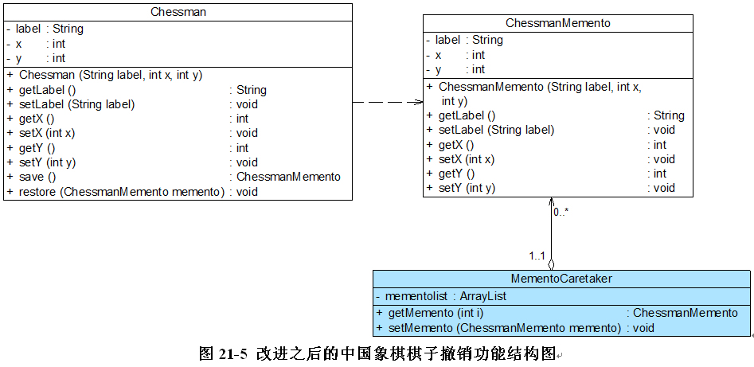

# 多步撤销——撤销与取消撤销

Sunny软件公司开发人员通过使用备忘录模式实现了中国象棋棋子的撤销操作，但是·`使用上面的代码只能实现一次撤销`，因为在负责人类中`只定义一个备忘录对象`来保存状态，
后面保存的状态会将前一次保存的状态覆盖，但有时候用户需要撤销多步操作。如何实现多次撤销呢？本节将提供一种多次撤销的解决方案，那就是在`负责人类中定义一个集合`来`存储多个备忘录`，
每个备忘录负责保存一个历史状态，在撤销时可以对备忘录集合进行`逆向遍历`，回到一个指定的历史状态，而且还可以对备忘录集合进行`正向遍历`， 实现`重做`(Redo)操作，`即取消撤销`，让对象状态得到恢复。
改进之后的中国象棋棋子撤销功能结构图：

我们仅对负责人类MementoCaretaker进行了修改，在其中定义了一个·`ArrayList类型`的集合对象来存储多个备忘录，其代码如下所示:

