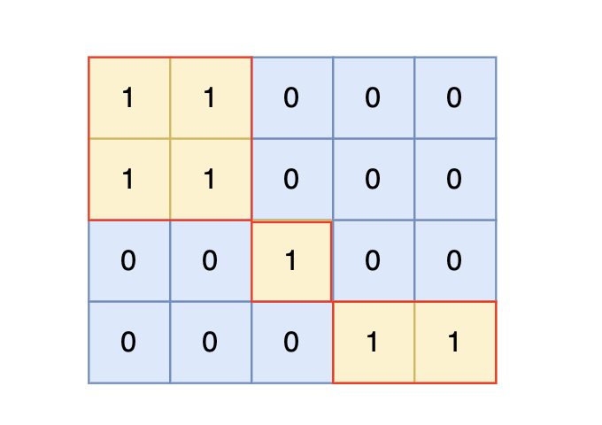

99. 岛屿数量
    卡码网题目链接（ACM模式）(opens new window)

题目描述：

给定一个由 1（陆地）和 0（水）组成的矩阵，你需要计算岛屿的数量。岛屿由水平方向或垂直方向上相邻的陆地连接而成，并且四周都是水域。你可以假设矩阵外均被水包围。

输入描述：

第一行包含两个整数 N, M，表示矩阵的行数和列数。

后续 N 行，每行包含 M 个数字，数字为 1 或者 0。

输出描述：

输出一个整数，表示岛屿的数量。如果不存在岛屿，则输出 0。

输入示例：
4 5
1 1 0 0 0
1 1 0 0 0
0 0 1 0 0
0 0 0 1 1

