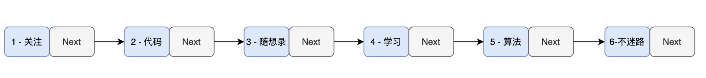
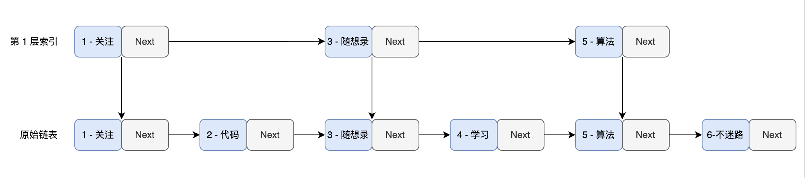
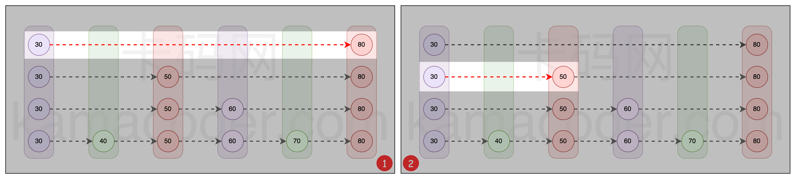
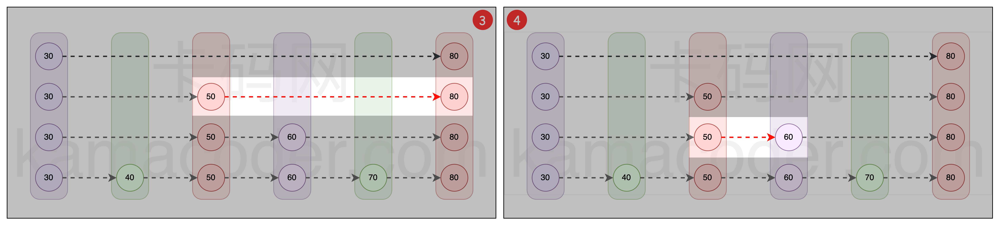
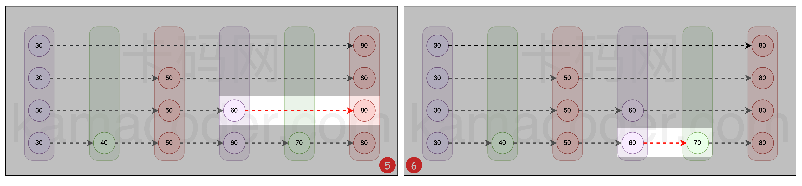
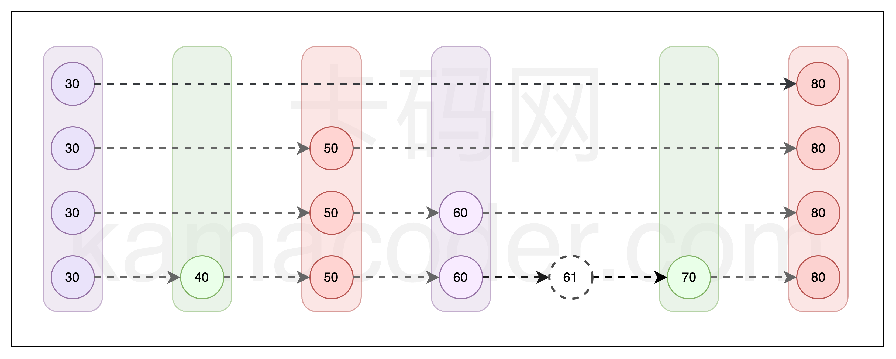
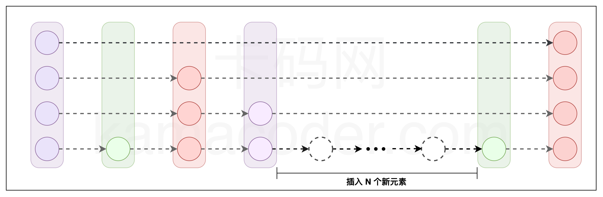
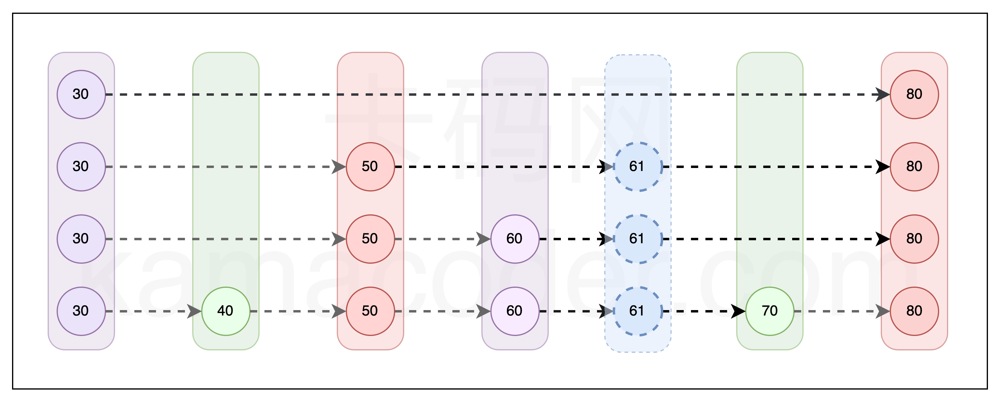

# 一、跳表概述
## 1.跳表地位
跳表是本K-V键值型数据库的核心数据结构。

## 2.跳表定义

跳表（Skip List）基于链表。是由 William Pugh 发明的一种数据结构，他本人对跳表的评价是：“`跳跃列表是在很多应用中有可能替代平衡树而作为实现方法的一种数据结构·`。
跳跃列表的算法有同平衡树一样的渐进的预期时间边界，并·`且更简单、更快速和使用更少的空间`。”

### 2.1前提条件——链表有序
设想我们的存储引擎是以有序链表作为基础构建的。在这样的设置下，存储引擎中的数据结构呈现如下特点：

`首先需要明确，我们所有的优化操作都基于链表是有序的这一前提。·`
其中每个节点都存储着一对键值对。为了便于理解，假设其中键是数字，值是字符串，并且它们按键的顺序排列。

这便`构成了一个基于有序链表的简易键值（K-V）存储引擎`。

### 2.2问题引出——查找费时
设想现在我们需要在存储引擎中查找特定键（比如 key = 6）对应的值。由于单链表的线性结构，我们不得不从头节点开始，逐个遍历节点。 例如，在查找 key = 6 的过程中，
我们需要按顺序检查每个节点，即查找路径为 1 -> 2 -> 3 -> 4 -> 5 -> 6。这种方法的时间复杂度为 O(n)，在数据量庞大时效率低下。 
`因此，需要一种更高效的查找方法， 而跳表正是这样的一种解决方案`。

---

### 2.3解决问题——提取索引
为了提高查找效率，我们采取了一种独特的策略：
`从原链表中选取关键节点作为索引层。这些被选出的节点形成了一个新的，较原链表更为简短的链表。`
由于原链表本身是有序的， 索引层中的节点也同样保持有序，利用这个有序性，我们能够加快查找速度。



在节点数量众多且索引层级充足的情况下，这种查找方法的效率极高。例如，如果在每层索引中，每两个节点就有一个被提升为上一层的索引，那么查找的时间复杂度可以`降至 O(log n)`，这与`二分查找的效率相仿`。
这样的机制不仅显著提升了查找效率，还在保持链表灵活性的同时，为我们的存储引擎带来了`接近二分查找的高效性能`。(本质是·`以空间换时间`).

---
## 3.核心操作——搜索节点
搜索操作是跳表中最基础的功能，不管是跳表的插入、删除，都依赖其搜索操作。

### 跳表的搜索流程：

`开始于顶层索引`：首先定位到跳表最顶层索引的首个节点
`水平遍历`：从最顶层的首个节点开始向右遍历。如果当前节点的下一个节点的值小于或等于待查找的值，表明该节点左侧的所有节点都小于或等于待查找值，此时跳转到下一个节点
`下沉操作`：若当前节点的下一个节点的值大于待查找值，意味着所需查找的节点位于当前位置左侧的某处，此时执行下沉操作，即向下移动到较低层的同一位置
`重复查找与下沉`：继续执行第二步和第三步的操作，直到到达最底层链表。在此层继续向右移动，直到找到目标节点或达到链表末端

一下是查找值为70的过程





## 4.插入节点
因为跳表的所有节点都是有序排列的，无论是插入还是删除操作，都`必须维持这种有序性`。
这一点使得跳表具有与平衡树相似的特性，`即它的任何操作都密切依赖于高效的查询机制`。





## 5.随机过程决定插入索引层级
跳表的索引构建是一个层层递进的过程。理想情况下，在原始链表中，我们每隔一个节点选择一个作为上层的索引。然后，把这一层的索引视为新的基础链表，重复同样的选择过程，直到顶层索引仅包含两个节点。

换句话说，由于任何节点都有一半的概率被选为上层的索引，一个节点出现在不同层级的概率呈逐层减半的趋势。例如，一个节点在第 1 层的出现概率是 100%，在第 2 层是 50%，在第 3 层是 25%，以此类推。

`在跳表中，如果一个节点出现在较高层级，它必然出现在所有较低的层级。例如，一个节点若出现在第 3 层，那么它必定存在于第 2 层和第 1 层。`

下面是一个简单的算法实现，用于确定跳表中节点的层级：
```java
private static int generateRandomLevel() {
    int level = 1;
    Random random = new Random();
    while (random.nextInt(2) == 1) {
        level++;
    }
    return level;
}
```

在这个算法中，random.nextInt(2) 将会生成不大于 2 的非负整数（只有 1 和 0）。如果这个随机数是 1，节点的层级就增加 1；如果是 0，循环结束并返回当前层级 level。

我们可以假设 random.nextInt(2) 生成的 1 和 0 的概率各为 50%。 因此，节点层级增加到 2 的概率是 50%。而层级增加到 3 的概率，`即两次生成的随机数都是 1，概率为 25%，以此类推`。

根据这个算法确定的层级，我们可以将节点插入到跳表中的相应层级。例如，在下图中，我们插入了数值为 61 的节点，并且 generateRandomLevel() 方法返回了 3，·`表示它会出现在第 1 层、第 2 层和第 3 层`。




## 6.删除节点
跳表的删除操作与插入操作类似。同样十分依赖于跳表的查询操作。在跳表中搜索到想要删除的节点后，需要将该节点以及该节点的索引一并删除。


## 7.应用跳表的工业应用
`Redis`：这是最著名的使用跳表的例子。Redis 是一个开源的高性能键值存储数据库，广泛用于缓存和消息队列等场景。在 Redis 中，跳表被用于实现有序集合（sorted sets）数据类型，
这主要是因为跳表在处理有序数据时可以提供良好的性能，尤其是在插入、删除和搜索操作上。

`LevelDB`：LevelDB 是一个由 Google 开发的快速键值存储库，用于存储非结构化数据。它使用跳表作为其内存中的数据结构，以支持快速的写入操作。跳表在 LevelDB 中帮助实现高效的数据插入和排序。

`RocksDB`：RocksDB 是 LevelDB 的一个分支，由 Facebook 进行了大量优化。它同样使用跳表来处理内存中的数据，以优化读写操作的性能。

`Apache HBase`：HBase 是一个分布式、可伸缩的大数据存储，基于 Google 的 BigTable 模型。在 HBase 中，跳表被用于实现 MemStore，即内存中的存储结构，以支持快速的数据写入和读取。


