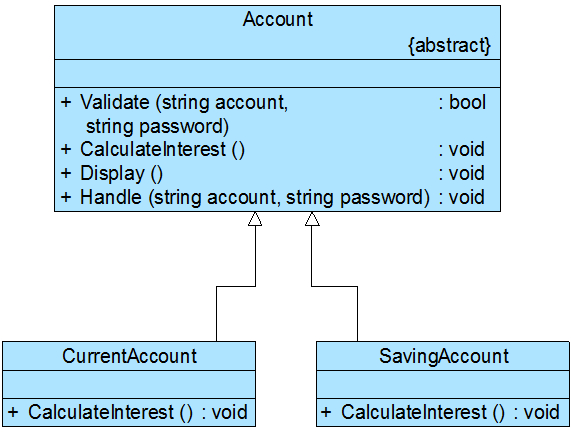

# 项目说明
某软件公司欲为某银行的业务支撑系统开发一个利息计算模块，利息计算流程如下：

   (1) 系统根据账号和密码验证用户信息，如果用户信息错误，系统显示出错提示；

   (2) 如果用户信息正确，则根据用户类型的不同使用不同的利息计算公式计算利息（如活期账户和定期账户具有不同的利息计算公式）；

   (3) 系统显示利息。

## 实例类图

Account充当抽象类角色，CurrentAccount和SavingAccount充当具体子类角色。

如果需要`增加新的具体子类（新的账户类型）`，`原有代码均无须修改，完全符合开闭原则`。

